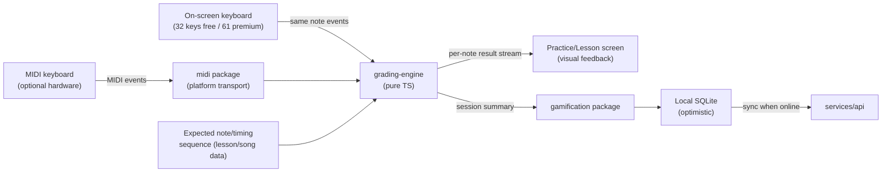
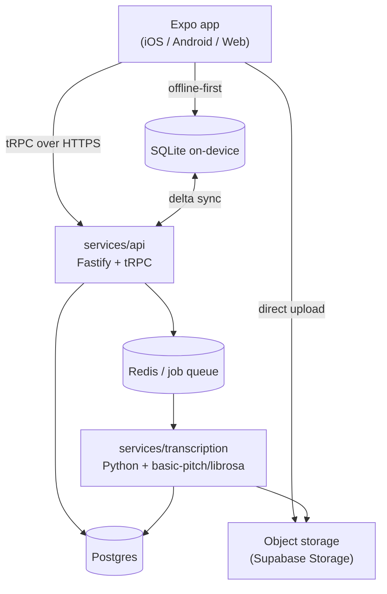
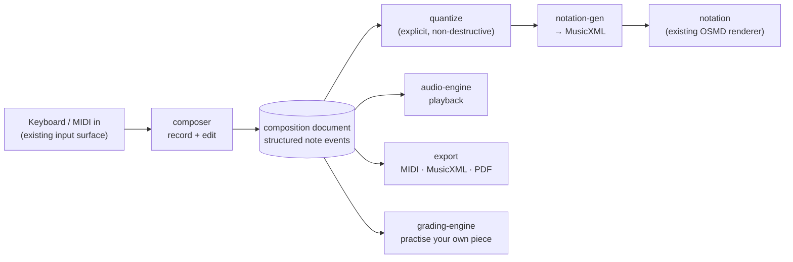

# 2. Technical Architecture

## 2.1 Shared-codebase decision

**Decision: Expo (React Native) as the single application codebase for iOS, Android,
and Web**, via Expo's web target (React Native Web under the hood), styled with
NativeWind (Tailwind syntax over React Native) for one component/styling system across
all three platforms.

**iOS, Android, and desktop web are three first-class outputs of this one codebase
from Milestone 1 onward — not a mobile app that web gets bolted onto later.** There is
no separate web codebase, no separate web team workflow, and no point in the roadmap
where web trails mobile in capability: the same Expo Router screens, the same
`packages/*` business logic, and the same component library render all three targets.
`apps/app` is the entire product on every platform — desktop web included. It is
explicitly **not** a landing page: log in from a browser and you get the real Keyvoria
learning experience (Home, Lesson Player, Ear Training, Sight-Reading, Playback &
Repeat, Upload your file, Progress Analytics — everything), laid out for a desktop
viewport rather than simplified or reduced. See "Responsive layout" below for how one
codebase
serves a touch phone screen and a mouse-and-keyboard desktop browser without forking
the UI.

Why this over "Next.js web app + separate React Native app":
- The product *is* an interactive app (practice screens, real-time MIDI feedback,
  gamified navigation), not a content/marketing site — there's little upside to a
  server-rendered web framework here, and duplicating navigation/screens/state across
  two codebases doubles the maintenance cost of exactly the surface area that changes
  most often (lesson player, practice screen), while also making feature parity
  between mobile and web a constant, effortful commitment rather than automatic.
- Expo Router gives one file-based navigation tree that compiles to native screens on
  iOS/Android and routes on web.
- ~90%+ code sharing is realistic for UI, navigation, state, and all business logic;
  the ~10% that must diverge (MIDI transport, low-level audio, file system access) is
  isolated behind package interfaces (§2.3) with a platform-specific implementation
  swapped in per target — this is the only place platform ever forks.

Trade-off accepted: web won't get Next.js's SEO/SSR benefits. That's an acceptable,
deliberate trade for an authenticated learning product where nothing meaningful needs
to be indexed by search engines — the alternative (a separate web stack) is what would
actually risk web becoming the neglected, catch-up platform the product brief warns
against. If a public marketing/landing page is wanted later, it is a *separate*,
unauthenticated, lightweight site (e.g. a small Next.js site) that exists purely to
market the product and send visitors to sign up — it is not "the website," and it is
out of scope for the app itself.

**DECISION NEEDED:** confirm this direction rather than a Flutter-based alternative.
Flutter would give comparable cross-platform reach and arguably stronger native-feel
performance, but the team's existing codebase (this repo) and stated skills are
TypeScript/React, so Expo/RN is the lower-risk default; call this out explicitly for
sign-off since it's the single highest-leverage decision in this document.

### 2.1a Responsive layout: one codebase, two shapes

The same components serve a 390px phone and a 1440px desktop browser by branching on
viewport, not by forking screens:

- **Breakpoints:** `< 768px` → mobile layout (bottom tab bar, single-column stacked
  content, per screen map §3.1); `≥ 1024px` → desktop layout (left navigation rail
  replaces the bottom tab bar, multi-column/wider layouts where a screen has room);
  `768–1024px` (tablet/narrow-desktop) gets the desktop chrome at reduced density
  rather than a third distinct layout, to keep the breakpoint count manageable.
- **Mechanism:** `useWindowDimensions` (React Native's cross-platform viewport hook)
  drives layout branches inside shared components — a `<PracticeScreenLayout>`
  component, for example, renders notation-over-keyboard stacked on mobile and
  notation-beside-keyboard side-by-side on desktop, from one component, one prop tree,
  not two implementations. NativeWind's responsive utility classes handle the smaller,
  purely-visual adjustments (spacing, font scale) without needing a JS branch at all.
- **Desktop gets real desktop affordances, not just more space:** hover states on
  interactive elements (tiles, library cards), keyboard shortcuts for the
  MIDI-heavy practice screens (space to pause, arrow keys to scrub), and layouts that
  use horizontal room deliberately (e.g. a category's Tier Ladder spreads wider
  rather than staying phone-narrow with empty margins). These are additive
  desktop-specific behaviors layered onto the same components, gated by platform
  checks, not a different app.
- This is designed in from Milestone 1 (the empty navigation shell already branches
  on breakpoint before any real screen is built), specifically so no team builds "the
  mobile version" first and retrofits desktop later.

## 2.2 Monorepo layout

Turborepo + pnpm workspaces.

```
keyvoria/
├── apps/
│   └── app/                     # Expo app — iOS, Android, Web (single codebase)
│       ├── app/                 # Expo Router screens (see screen-map doc)
│       ├── src/
│       └── app.config.ts
├── services/
│   ├── api/                     # Backend API (Fastify + tRPC), see §2.6
│   └── transcription/           # Python microservice, audio→MIDI + tempo detection
├── packages/
│   ├── core-theory/             # Pure TS: music theory primitives (scales, chords,
│   │                             #   intervals, key detection) — no I/O
│   ├── grading-engine/          # Pure TS: compares a live note-event stream (from
│   │                             #   MIDI hardware OR the on-screen keyboard) against
│   │                             #   an expected note/timing sequence → accuracy score
│   ├── gamification/            # Pure TS: XP-earning curve, the per-category tier-
│   │                             #   unlock economy (validates an unlock purchase
│   │                             #   against current balance server-side — never
│   │                             #   trusts a client-reported balance), streak/freeze
│   │                             #   logic, achievement rule evaluation — used by
│   │                             #   both client (optimistic local update) and
│   │                             #   server (source of truth)
│   ├── content-schema/          # Zod schemas for lessons/exercises/progressions/songs
│   ├── midi/                    # Common MIDI interface; platform impls (web/native)
│   ├── audio-engine/            # Common playback/looping/speed-change interface;
│   │                             #   platform impls
│   ├── notation/                # Sheet-music rendering (OSMD-in-WebView, see §2.4)
│   ├── ui/                      # NativeWind component library, shared across app —
│   │                             #   includes the on-screen keyboard (range driven by
│   │                             #   entitlements.plan), mounted by every play screen
│   │                             #   in every category, emitting midi-shaped events
│   ├── analysis/                # Difficulty scoring, MIDI/MusicXML parsing/segmenting
│   │                             #   (shared by "Upload your file" client + server paths);
│   │                             #   also the skill/weakness analysis of §2.12
│   ├── entitlements/            # Capability registry and can() — the ONLY place a
│   │                             #   plan maps to features (§2.10)
│   ├── composer/                # Composition document model + edit ops (§2.11, F-11)
│   └── notation-gen/            # Quantized events → MusicXML for the composer
├── content/                     # Authored lesson/song content: JSON + MusicXML,
│                                 #   validated against content-schema in CI
└── infra/                       # IaC, CI configs
```

The `content/` directory follows a git-based content pattern (in the spirit of tools
like Stackbit/Netlify's Git Content Source): structured content lives in git,
versioned and reviewable like code, and gets ingested into Postgres by a build step
rather than hand-entered through an admin UI. This is a good fit for 25–50 exercises
etc. authored by a small content team, and avoids building a CMS for V1.

## 2.3 Platform-divergent packages — interface pattern

Every package that must differ per platform exposes one TypeScript interface and
platform-specific implementations selected via Expo/Metro's platform file extensions
(`.web.ts` / `.native.ts`):

```ts
// packages/midi/src/types.ts
export interface MidiTransport {
  listDevices(): Promise<MidiDeviceInfo[]>;
  connect(deviceId: string): Promise<void>;
  onNoteEvent(cb: (e: MidiNoteEvent) => void): () => void; // returns unsubscribe
  onDisconnect(cb: () => void): () => void;
}
```

- `packages/midi/src/transport.web.ts` — Web MIDI API (`navigator.requestMIDIAccess`).
- `packages/midi/src/transport.native.ts` — thin Expo native module wrapping CoreMIDI
  (iOS) and the Android MIDI API (`android.media.midi`), exposed as one JS interface.
  Bluetooth MIDI: CoreMIDI handles BLE-MIDI pairing on iOS natively; Android requires
  the standard BLE MIDI peripheral flow — both are addressed in the native module, not
  in shared JS.

Same pattern for `audio-engine` (Web Audio API + Tone.js on web; native audio module —
evaluate `react-native-audio-api` vs. a thin Expo module over `AVAudioEngine`/Oboe — on
native) and for file-system/upload handling.

## 2.4 Notation rendering

**Decision:** render sheet music via **OpenSheetMusicDisplay (OSMD)**, an
SVG/MusicXML renderer, hosted inside a WebView (`react-native-webview`) on iOS/Android
and mounted directly in the DOM on web. This gives one rendering engine and one visual
result across all three platforms instead of maintaining a native canvas notation
renderer, at the cost of a WebView bridge on native (acceptable: notation is not the
latency-critical surface — MIDI grading is handled natively outside the WebView and
just posts highlight/cursor updates *into* it).

MIDI-file parsing (for "Upload your file" and for internally authored exercises/songs
that start life as MIDI) uses `@tonejs/midi` or `midi-file` (pure JS, shared across
platforms). MusicXML parsing reuses OSMD's own parser for rendering and
`musicxml-interfaces`-style parsing for the difficulty-analysis package where a plain
data model (not a render tree) is needed.

## 2.5 Grading engine (the core real-time loop)



`grading-engine` takes an expected sequence (notes with pitch, target onset time,
duration, and optional voicing tolerance for chords) and a live MIDI event stream, and
emits per-note results (`hit` / `wrong-note` / `early` / `late` / `missed`) plus a
session accuracy score. It is deterministic and platform-agnostic so it can also run
server-side for "Upload your file" performance grading if a session needs re-verification
(e.g. leaderboard/achievement integrity checks later), and is unit-testable without any
device.

**Two input surfaces, one pipeline.** The engine takes a note-event stream, not a
"MIDI stream" — it does not know or care where events came from. The **on-screen
keyboard is shared UI infrastructure**, not an Ear-Training-specific widget: one
component, mounted by every play surface in every category (PRD F-02, screen map
§3.3.1a), emitting the same `{ pitch, velocity, timestamp, type }` events the `midi`
package emits. Two consequences worth designing for up front:

- **Range is a prop, not a fork.** The component reads `entitlements.plan` for its
  key range (32 keys / 61 keys). No category has its own keyboard variant, so the
  free-vs-premium range change is a single value, not a per-screen branch.
- **Tolerance is a grading parameter, not a second engine.** On-screen input carries
  touch latency and no real velocity, so the engine accepts a tolerance profile per
  input source (wider timing windows, velocity checks skipped for `on_screen`). The
  matching logic itself is identical — one code path, one set of tests, with the
  source recorded on `attempts` / `repeat_rounds` (DB §4.8, §4.9a).

## 2.6 Backend

- **Fastify + tRPC**, TypeScript end-to-end (shared types with the app via the
  monorepo, no REST schema drift).
- **Supabase** for Postgres + Auth + Object Storage in V1: minimizes infra build time
  for a V1, gives row-level-security-backed multi-tenant data out of the box, and a
  managed Postgres the team fully owns the schema for (see
  [database doc](./04-database-schema.md)) — not locked into Supabase-specific
  features, so a later migration to self-hosted Postgres + a different auth/storage
  provider stays possible.
- **Redis** (via Supabase-compatible or a small managed instance) for session/job
  queue state.
- **Job queue** (BullMQ on Redis) for async work: audio transcription requests,
  MIDI/MusicXML difficulty analysis on upload, XP/achievement recompute fan-out.
- **services/transcription** (Python, FastAPI): wraps `basic-pitch` (Spotify's OSS
  audio→MIDI model) for best-effort note transcription and `librosa` for tempo/beat
  detection. Kept as a separate service (not in the Node API) because the ML stack is
  Python-native; communicates via the job queue, not synchronous HTTP, since
  transcription is not instant.



## 2.6a Billing & subscription lifecycle

Keyvoria Plus is one $5.95/month subscription sold on three storefronts, and the
storefronts are not equivalent — this is the main reason billing gets its own section
rather than being a detail of the API.

**Server-side entitlement, store-side billing.** The app never decides what a user is
entitled to; `entitlements` (DB §4.2) does, written only by our backend in response to
provider webhooks. This is what lets someone subscribe on an iPhone and immediately
have tier 4 and the 61-key keyboard in a desktop browser (§2.7), and it is why a
client claiming "I just subscribed" triggers a refetch rather than a grant.

**Recommendation: RevenueCat in front of the three providers**, rather than
integrating StoreKit, Play Billing, and Stripe separately. It normalizes the three
into one webhook shape and one entitlement concept, which is disproportionately
valuable here because the *cross-platform* case is the norm for this product, not an
edge case. The alternative — three integrations and our own reconciliation — is
weeks of work whose only output is parity with a service that costs little at V1
volume. `DECISION NEEDED` at implementation time, but this is the default.

**Cancellation is asymmetric and the UI must not hide it** (PRD F-07, screen map
§3.8.1):

| Platform | Who owns the subscription | Cancel path |
|---|---|---|
| Web | Us, via Stripe | Backend sets `cancel_at_period_end`; in-app, immediate UI update |
| iOS | Apple | **No server-side cancel exists.** Deep-link to the system Manage Subscriptions sheet |
| Android | Google | Same: deep-link to the Play subscription centre |

Two consequences worth designing for now rather than discovering later:

- **Cancelling is a flag, not a downgrade.** `cancel_at_period_end = true` leaves
  `entitlements.plan = paid` until `current_period_end`, when the provider webhook
  (backed by a scheduled sweep, since webhooks can be missed) downgrades it. Never
  revoke access at the moment of the cancel request — the user paid for that period.
- **Store review rules apply to the copy, not just the code.** Apple requires that
  subscription terms, price, and renewal be stated at the point of purchase, and it
  will reject a build whose cancel affordance misleads about where cancellation
  happens. The honest deep-link is also the compliant one.

**Refunds and disputes are out of scope for V1's UI** — they route to Apple/Google/
Stripe support rather than an in-app flow, which is the norm for a product this size
and avoids building a refund-adjudication surface for a single price point.

## 2.7 Offline & sync model

The same account, signed into a phone and a desktop browser, is the same state — that
is the whole point of a shared backend rather than two platform-specific ones. What
that covers concretely, all keyed off one `user_id` in Postgres (§4, database schema):

- **XP balance, lifetime XP (cosmetic Level), streaks** (`xp_events`/
  `user_category_unlocks`/`streaks`, §4.10) — earned or spent on one device,
  visible immediately on the other next time it's online.
- **Unlocked category tiers & lesson progress** (`user_category_unlocks`,
  `user_progress`, §4.9b/§4.8) — spend XP to unlock a Sight-Reading tier on mobile on
  the train, the exact same unlocked tier (and the lessons it reveals) is there on
  desktop at a real keyboard, same record either way.
- **Entitlements/subscription state** (`entitlements`) — buy Keyvoria Plus on one
  device, the 61-key on-screen keyboard, Upload your file, and every category's
  premium-only tiers unlock everywhere, immediately, since the check is a live read
  against Postgres, not a per-device flag.
- **Uploaded music** (`user_uploads` in Supabase Storage, `generated_tutorials` in
  Postgres) — upload an MP3 or MIDI file from either platform, it's in "My Uploads"
  on both, because the file itself lives in cloud object storage, not on-device.

None of the above needs a special sync protocol — it's simply server-authoritative
data read fresh (or from a short-lived cache) whenever a screen needs it, the same as
any other multi-device web/app product. The part that *does* need explicit offline
handling is narrower:

- Lesson/song *content* (MusicXML, MIDI reference, metadata) is downloaded on demand
  and cached in on-device SQLite + file storage (`expo-sqlite` / `op-sqlite`) so
  practice works offline once a unit is downloaded. This cache is per-device and is
  not itself "synced" — it's a local performance/offline copy of server data.
- *In-session attempt data* (individual note events, in-progress XP events, streak
  state changes) is written locally first (optimistic) while offline or mid-session,
  and synced to Postgres via a delta-sync endpoint when connectivity returns. XP/streak
  are recomputed server-side as the source of truth; client-local values are a
  best-effort projection that reconciles on sync (last-write-wins is not sufficient for
  XP — server sums authoritative XP events, never trusts a client-provided total).
  This is what makes "offline on the subway, online again at the desk" work without
  losing or double-counting a practice session.

## 2.8 Key third-party building blocks (V1 shortlist)

| Concern | Choice | Notes |
|---|---|---|
| Cross-platform app shell | Expo + Expo Router | §2.1 |
| Styling | NativeWind | Tailwind syntax, reuses team's existing Tailwind familiarity from this repo |
| Notation rendering | OpenSheetMusicDisplay in WebView | §2.4 |
| MIDI file parsing | `@tonejs/midi` | pure JS |
| Web MIDI | Web MIDI API (native browser) | Chrome/Edge support is solid; Safari is the gap — flag as a known web-platform limitation, not fixable by us |
| Native MIDI | Custom Expo native module (CoreMIDI / android.media.midi) | §2.3 |
| Audio synthesis/playback | Tone.js (web), native audio module (native) | pitch-preserving time-stretch needed for the 0.25×–2× speed range — evaluate `soundtouch`-based approach |
| Audio→MIDI transcription | `basic-pitch` (Python) | best-effort, always labeled estimated per F-05 |
| Tempo/beat detection | `librosa` | |
| Backend | Fastify + tRPC | |
| DB/Auth/Storage | Supabase (Postgres) | |
| Job queue | BullMQ + Redis | |
| Local DB | SQLite (`expo-sqlite`/`op-sqlite`) | |

## 2.9 What Milestone 1 does to *this* repository

This repository (`IndraKar/keyboard-app`) is dedicated to the app and currently empty
apart from this `docs/` planning set. Milestone 1 (see [roadmap](./05-roadmap.md))
scaffolds the monorepo layout above directly into it — no prior app code to remove or
migrate.
## 2.10 The premium capability layer

**Problem this solves.** Today three separate places ask "is this user on Plus?" — the
keyboard's range, tier 4's purchase check, and Upload your file's preview cap. That is
already three; the features in PRD F-09/F-10/F-11 would make it eight or nine, each a
separate `plan === "paid"` test scattered through unrelated code. That is how a
premium tier becomes impossible to change: the plan's meaning ends up encoded in
dozens of call sites rather than in one place.

**Decision: gate on named capabilities, never on the plan.** One registry maps a plan
to a set of capability names; every feature asks `can("compose.create")`, never
`plan === "paid"`.

```ts
// packages/entitlements
export type Capability =
  | "keyboard.61"          // 61-key range          (F-02)
  | "tier.4"               // expert tier purchase  (F-03)
  | "song.full_length"     // beyond the 30s preview (F-05)
  | "practice.tools"       // looping, hands-separate, speed set (F-05)
  | "analysis.advanced"    // timing profile, trends (F-09)
  | "practice.recommended" // generated weakness sessions (F-10)
  | "compose.create"       // the composer            (F-11)
  | "compose.export";      // MIDI/MusicXML/PDF out   (F-11)

const PLAN_CAPABILITIES: Record<Plan, Capability[]> = {
  free:  [],
  trial: [...ALL],
  paid:  [...ALL],
};
export const can = (c: Capability) => currentCapabilities().includes(c);
```

Four things this buys, all of which the alternative makes expensive:

- **Adding a premium feature is additive.** A new capability name, a new gate. No
  existing check is edited, so no existing feature can regress — which is exactly the
  modularity PRD F-11 asks for.
- **Plans become data.** A future annual plan, a student discount, a lifetime tier, or
  a promotional grant is a new row in the map, not a new branch in nine files.
- **Per-capability grants become possible** without redesign — a beta tester given
  `compose.create` alone, or a capability temporarily disabled during an incident.
- **It is testable as a unit.** "Free users cannot export" is one assertion against the
  registry, rather than a UI test per surface.

**The server is still the authority.** `can()` drives *what the UI offers*; every
capability that costs money or writes data is re-checked server-side on the mutation,
exactly as tier unlocks already are (§2.6). A client that lies gets a rejected request,
not a free composer.

**Migration:** M10 replaces the three existing plan checks with capability checks
before any new premium feature is built. Doing it after would mean writing the new
features against the pattern being removed.

## 2.11 Composition & notation pipeline (PRD F-11)

Three packages, deliberately separate, because they fail and evolve independently:



- **`composer`** — the document model and edit operations (insert, move, retune,
  resize, delete, undo). Pure TypeScript over the structured document, no rendering and
  no audio, so the entire edit history is unit-testable without a device.
- **`notation-gen`** — quantized events → MusicXML. This is the genuinely hard part and
  the one most likely to need iteration: voice separation, beaming, rests, ties,
  enharmonic spelling from the key signature. Keeping it behind a MusicXML boundary
  means the existing `notation` package renders its output with no changes, and a
  better generator can be swapped in later without touching the composer.
- **Export** reuses `notation-gen`'s MusicXML and the document's MIDI serialisation.
  PDF is rendering, not a new format.

**Two structural decisions:**

- **The performance is stored unquantized; quantization is a view.** The document keeps
  what was actually played, and the quantize setting is applied on the way to notation
  and playback. This is what makes the setting non-destructive and adjustable forever,
  and it means a later, smarter quantizer improves every existing composition rather
  than only new ones.
- **The composition document is the same shape the grading engine already consumes** —
  a note/timing sequence (§2.5). A user can therefore practise their own composition
  through the existing pipeline with no new grading code. That reuse is the main reason
  to insist on structured data over audio, beyond export.

**Sync.** Compositions are account data, not device data (§2.7): they sync like
progress and uploads. A composition edited on an iPad opens on the web with its edit
state intact. Conflict policy is last-write-wins per composition with a local
autosave buffer — the same policy as other user documents; a note-level merge is
out of scope and would be disproportionate for a single-author document.

## 2.12 Skill analysis engine (PRD F-09/F-10)

**Attribution happens at grading time, not in a later batch job.** When the
`grading-engine` produces a result it also emits the **skill keys** that item
exercised (`chord.diminished`, `interval.tritone`, `sight.key.G`, `rhythm.eighth`,
`hand.left`). Those accumulate into `skill_observations` (DB §4.14).

This ordering is the whole design, and it is why the substrate lands early in the
roadmap: **you cannot reconstruct which skill an exercise trained after the fact.**
`attempts` records that a user scored 64%, not that the item was a diminished chord in
second inversion. If attribution is deferred, every exercise played before it ships is
permanently unusable for recommendations — so M10 writes observations even though the
UI that reads them is M11.

- `analysis` package (pure TS): observations → weakest eligible skills, respecting the
  minimum-sample rule (PRD F-10). Deterministic and unit-testable; no model, no
  service.
- Recommendation *generation* reuses the existing procedural generators — the
  recommended session is ordinary exercises with a constrained pool, not a new
  content type. That is what keeps this feature small.
- **Room for AI later, without depending on it.** The recommender is an interface with
  a deterministic implementation. A future model-backed implementation can replace it
  behind the same interface; nothing in V1 requires one, and shipping a heuristic that
  works beats waiting for a model that might.

