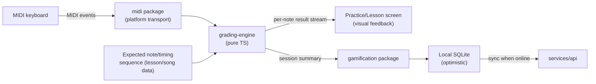
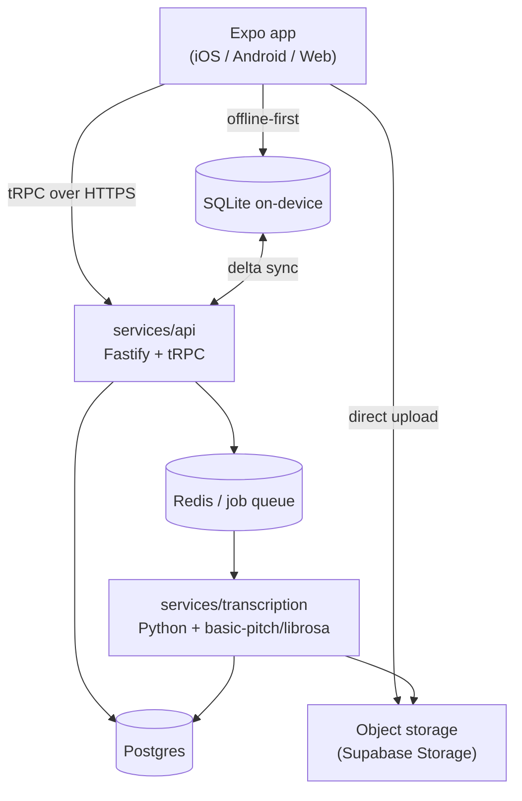

# 2. Technical Architecture

## 2.1 Shared-codebase decision

**Decision: Expo (React Native) as the single application codebase for iOS, Android,
and Web**, via Expo's web target (React Native Web under the hood), styled with
NativeWind (Tailwind syntax over React Native) for one component/styling system across
all three platforms.

Why this over "Next.js web app + separate React Native app":
- The product *is* an interactive app (practice screens, real-time MIDI feedback,
  gamified navigation), not a content/marketing site — there's little upside to a
  server-rendered web framework here, and duplicating navigation/screens/state across
  two codebases doubles the maintenance cost of exactly the surface area that changes
  most often (lesson player, practice screen).
- Expo Router gives one file-based navigation tree that compiles to native screens on
  iOS/Android and routes on web.
- ~90%+ code sharing is realistic for UI, navigation, state, and all business logic;
  the ~10% that must diverge (MIDI transport, low-level audio, file system access) is
  isolated behind package interfaces (§2.3) with a platform-specific implementation
  swapped in per target.

Trade-off accepted: web won't get Next.js's SEO/SSR benefits. That's fine — this is an
authenticated app experience, not a marketing surface. If a marketing/landing site is
wanted later, it can be a *separate* lightweight Next.js site — out of scope for the
app itself.

**DECISION NEEDED:** confirm this direction rather than a Flutter-based alternative.
Flutter would give comparable cross-platform reach and arguably stronger native-feel
performance, but the team's existing codebase (this repo) and stated skills are
TypeScript/React, so Expo/RN is the lower-risk default; call this out explicitly for
sign-off since it's the single highest-leverage decision in this document.

## 2.2 Monorepo layout

Turborepo + pnpm workspaces.

```
keypath/
├── apps/
│   └── app/                     # Expo app — iOS, Android, Web (single codebase)
│       ├── app/                 # Expo Router screens (see screen-map doc)
│       ├── src/
│       └── app.config.ts
├── services/
│   ├── api/                     # Backend API (Fastify + tRPC), see §2.6
│   └── transcription/           # Python microservice, audio→MIDI + tempo detection
├── packages/
│   ├── core-theory/             # Pure TS: music theory primitives (scales, chords,
│   │                             #   intervals, key detection) — no I/O
│   ├── grading-engine/          # Pure TS: compares live MIDI input stream against
│   │                             #   an expected note/timing sequence → accuracy score
│   ├── gamification/            # Pure TS: XP curve, streak/freeze logic, achievement
│   │                             #   rule evaluation — used by both client (optimistic
│   │                             #   local update) and server (source of truth)
│   ├── content-schema/          # Zod schemas for lessons/exercises/progressions/songs
│   ├── midi/                    # Common MIDI interface; platform impls (web/native)
│   ├── audio-engine/            # Common playback/looping/speed-change interface;
│   │                             #   platform impls
│   ├── notation/                # Sheet-music rendering (OSMD-in-WebView, see §2.4)
│   ├── ui/                      # NativeWind component library, shared across app
│   └── analysis/                # Difficulty scoring, MIDI/MusicXML parsing/segmenting
│                                 #   (shared by "Learn My Music" client + server paths)
├── content/                     # Authored lesson/song content: JSON + MusicXML,
│                                 #   validated against content-schema in CI
└── infra/                       # IaC, CI configs
```

The `content/` directory follows a git-based content pattern (in the spirit of tools
like Stackbit/Netlify's Git Content Source): structured content lives in git,
versioned and reviewable like code, and gets ingested into Postgres by a build step
rather than hand-entered through an admin UI. This is a good fit for 25–50 exercises
etc. authored by a small content team, and avoids building a CMS for V1.

## 2.3 Platform-divergent packages — interface pattern

Every package that must differ per platform exposes one TypeScript interface and
platform-specific implementations selected via Expo/Metro's platform file extensions
(`.web.ts` / `.native.ts`):

```ts
// packages/midi/src/types.ts
export interface MidiTransport {
  listDevices(): Promise<MidiDeviceInfo[]>;
  connect(deviceId: string): Promise<void>;
  onNoteEvent(cb: (e: MidiNoteEvent) => void): () => void; // returns unsubscribe
  onDisconnect(cb: () => void): () => void;
}
```

- `packages/midi/src/transport.web.ts` — Web MIDI API (`navigator.requestMIDIAccess`).
- `packages/midi/src/transport.native.ts` — thin Expo native module wrapping CoreMIDI
  (iOS) and the Android MIDI API (`android.media.midi`), exposed as one JS interface.
  Bluetooth MIDI: CoreMIDI handles BLE-MIDI pairing on iOS natively; Android requires
  the standard BLE MIDI peripheral flow — both are addressed in the native module, not
  in shared JS.

Same pattern for `audio-engine` (Web Audio API + Tone.js on web; native audio module —
evaluate `react-native-audio-api` vs. a thin Expo module over `AVAudioEngine`/Oboe — on
native) and for file-system/upload handling.

## 2.4 Notation rendering

**Decision:** render sheet music via **OpenSheetMusicDisplay (OSMD)**, an
SVG/MusicXML renderer, hosted inside a WebView (`react-native-webview`) on iOS/Android
and mounted directly in the DOM on web. This gives one rendering engine and one visual
result across all three platforms instead of maintaining a native canvas notation
renderer, at the cost of a WebView bridge on native (acceptable: notation is not the
latency-critical surface — MIDI grading is handled natively outside the WebView and
just posts highlight/cursor updates *into* it).

MIDI-file parsing (for "Learn My Music" and for internally authored exercises/songs
that start life as MIDI) uses `@tonejs/midi` or `midi-file` (pure JS, shared across
platforms). MusicXML parsing reuses OSMD's own parser for rendering and
`musicxml-interfaces`-style parsing for the difficulty-analysis package where a plain
data model (not a render tree) is needed.

## 2.5 Grading engine (the core real-time loop)



`grading-engine` takes an expected sequence (notes with pitch, target onset time,
duration, and optional voicing tolerance for chords) and a live MIDI event stream, and
emits per-note results (`hit` / `wrong-note` / `early` / `late` / `missed`) plus a
session accuracy score. It is deterministic and platform-agnostic so it can also run
server-side for "Learn My Music" performance grading if a session needs re-verification
(e.g. leaderboard/achievement integrity checks later), and is unit-testable without any
device.

## 2.6 Backend

- **Fastify + tRPC**, TypeScript end-to-end (shared types with the app via the
  monorepo, no REST schema drift).
- **Supabase** for Postgres + Auth + Object Storage in V1: minimizes infra build time
  for a V1, gives row-level-security-backed multi-tenant data out of the box, and a
  managed Postgres the team fully owns the schema for (see
  [database doc](./04-database-schema.md)) — not locked into Supabase-specific
  features, so a later migration to self-hosted Postgres + a different auth/storage
  provider stays possible.
- **Redis** (via Supabase-compatible or a small managed instance) for session/job
  queue state.
- **Job queue** (BullMQ on Redis) for async work: audio transcription requests,
  MIDI/MusicXML difficulty analysis on upload, XP/achievement recompute fan-out.
- **services/transcription** (Python, FastAPI): wraps `basic-pitch` (Spotify's OSS
  audio→MIDI model) for best-effort note transcription and `librosa` for tempo/beat
  detection. Kept as a separate service (not in the Node API) because the ML stack is
  Python-native; communicates via the job queue, not synchronous HTTP, since
  transcription is not instant.



## 2.7 Offline & sync model

- Lesson/song *content* (MusicXML, MIDI reference, metadata) is downloaded on demand
  and cached in on-device SQLite + file storage (`expo-sqlite` / `op-sqlite`) so
  practice works offline once a unit is downloaded.
- *Progress* (attempts, XP events, streak state) is written locally first (optimistic)
  and synced to Postgres via a delta-sync endpoint when connectivity returns. XP/streak
  are recomputed server-side as the source of truth; client-local values are a
  best-effort projection that reconciles on sync (last-write-wins is not sufficient for
  XP — server sums authoritative XP events, never trusts a client-provided total).

## 2.8 Key third-party building blocks (V1 shortlist)

| Concern | Choice | Notes |
|---|---|---|
| Cross-platform app shell | Expo + Expo Router | §2.1 |
| Styling | NativeWind | Tailwind syntax, reuses team's existing Tailwind familiarity from this repo |
| Notation rendering | OpenSheetMusicDisplay in WebView | §2.4 |
| MIDI file parsing | `@tonejs/midi` | pure JS |
| Web MIDI | Web MIDI API (native browser) | Chrome/Edge support is solid; Safari is the gap — flag as a known web-platform limitation, not fixable by us |
| Native MIDI | Custom Expo native module (CoreMIDI / android.media.midi) | §2.3 |
| Audio synthesis/playback | Tone.js (web), native audio module (native) | pitch-preserving time-stretch needed for 25/50/75% speed — evaluate `soundtouch`-based approach |
| Audio→MIDI transcription | `basic-pitch` (Python) | best-effort, always labeled estimated per F-06 |
| Tempo/beat detection | `librosa` | |
| Backend | Fastify + tRPC | |
| DB/Auth/Storage | Supabase (Postgres) | |
| Job queue | BullMQ + Redis | |
| Local DB | SQLite (`expo-sqlite`/`op-sqlite`) | |

## 2.9 What Milestone 1 does to *this* repository

This repository (`IndraKar/keyboard-app`) is dedicated to the app and currently empty
apart from this `docs/` planning set. Milestone 1 (see [roadmap](./05-roadmap.md))
scaffolds the monorepo layout above directly into it — no prior app code to remove or
migrate.
