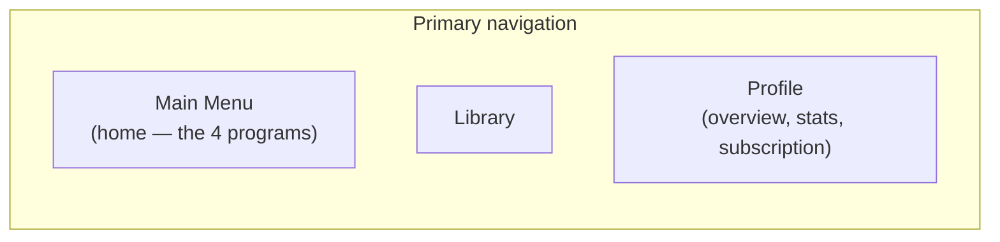

# 3. Screen Map

## 3.1 Navigation model

**Three** primary destinations, built on Expo Router so the same route tree drives
every platform — iOS, Android, and desktop web are all the full product (architecture
§2.1), not a mobile app with a companion site.

**The Main Menu is the app's home.** Launching Keyvoria lands on the Main Menu, not on
a dashboard — the first thing a user sees is the choice of which of the four programs
to work on (PRD §1.4). This replaces an earlier draft's separate Home/Dashboard tab,
which sat in front of the Main Menu and delayed that choice behind a screen of
summary cards. Two consolidations follow from it:

- The old **Home/Dashboard tab is gone as a destination**. Its momentum features
  (Continue, Daily Challenge) move onto the Main Menu itself, where resuming is one
  tap from landing (§3.5); its summary/stats content moves to Profile.
- The old **Profile tab absorbs that stats content** and becomes the user's overview:
  who they are, how much they've practiced, how much XP they've earned, and their
  subscription (§3.9). One "about me" surface instead of two.

**Chrome is responsive, not platform-specific** (architecture §2.1a): below the
1024px breakpoint this renders as a bottom tab bar (phone-width mobile and narrow
browser windows alike); at 1024px and up it becomes a left navigation rail, and
individual screens pick up desktop-only layout — e.g. a category's Tier Ladder and the
Practice Screen use the extra horizontal room rather than staying phone-narrow with
empty margins either side. The same account, the same XP/progress/entitlements/
uploads, and the same screen inventory below apply on every platform (architecture
§2.7) — what changes with viewport width is layout, never which features exist.

Onboarding and the MIDI setup flow sit outside the tab bar (full-screen, linear).
The Learn My Music upload flow is entered from the Main Menu or Library but opens as
its own modal/stack flow since it has a distinct linear upload → processing → result
shape.

## 3.2 Onboarding flow (pre-tab-bar, first launch only)

1. **Welcome / value prop** — 2–3 swipeable screens.
2. **Goal selection** — "play songs I love" / "learn theory & reading" / "classical
   repertoire" / "improvise & play by ear" (feeds a recommendation of which category
   to focus on first — PRD F-06 — not a fixed path assignment).
3. **Skill assessment (skippable)** — a few quick play-along or multiple-choice
   probes (uses the on-screen keyboard if no MIDI device yet) that can grant a
   starting XP boost and/or pre-unlock an early tier in the relevant category or two,
   instead of every category always starting at tier 1.
4. **MIDI setup** — detect/pair a MIDI keyboard; explicit "I don't have one yet, use
   on-screen keyboard" fallback that doesn't dead-end the flow. A free-tier user
   choosing the fallback sees a 32-key on-screen keyboard (PRD §1.4's Free vs.
   Premium table); this isn't a paywall moment during onboarding, just how the
   keyboard renders — the upgrade CTA lives in Profile/paywall screens, not here.
5. **Account creation** — email/social sign-in (needed to persist progress across
   devices); guest mode allowed with a clear "progress stays on this device only"
   notice, upgradeable to an account later without losing local progress.
6. → lands on the **Main Menu** (§3.3), the app's home.

## 3.3 Tab: Main Menu — the home screen

**This is where Keyvoria opens.** The Main Menu is both the app's home screen and its
curriculum — the user's first decision is which program to work on, not which summary
card to read. Exactly **four** tiles, one per category (PRD §1.4):

1. **Ear Training** → this category's Tier Ladder (below)
2. **Sight-Reading** → this category's Tier Ladder (below) — the drill itself has no
   setup screen, but the category still has a Tier Ladder to browse/unlock from
3. **Playback & Repeat** → this category's Tier Ladder (below)
4. **Learn My Music** *(Premium badge if not entitled)* → paywall screen if not
   entitled, otherwise the upload flow (§3.7)

There is no fifth "Warm Up"/"Free Play" tile in V1 (PRD §1.4). Every tile leads into
that category's own space and returns here on exit rather than dead-ending — since
this is the home screen, "back out of what I was doing" and "go home" are the same
gesture, and no flow needs a separate route back to a dashboard.

**Above the tiles, one compact momentum strip** — the two things the retired Home tab
did that a landing screen genuinely needs, kept deliberately small so the four tiles
stay the visual focus:

- **Continue** — a single row resuming the last in-progress lesson/upload, shown only
  when there *is* one. Absent for a user with nothing in progress, rather than
  rendering an empty state.
- **Today's Daily Challenge** — one line with its bonus-XP reward, collapsing to a
  "done" checkmark once completed.
- **Spendable XP balance** sits in the header next to the Show Note Names toggle, as
  a number, not a card — it's the figure that decides whether a tier is affordable, so
  it belongs wherever the user is choosing what to do next.

Everything else the old dashboard carried — recommended-next-unlock, achievement
strips, streak summaries, lifetime stats — moves to Profile (§3.9). The rule for what
earns a place here: it either *starts* an activity or it *decides* which activity to
start. Anything that only reports on past activity belongs in Profile.

A **Show Note Names** toggle (PRD F-02a) sits in this screen's header, not per-tile —
it's one setting that applies to every keyboard shown anywhere in the app, so it's set
once from the hub rather than re-toggled per mode.

### 3.3.1 Category Tier Ladder (shared shape, used by all three tiered categories)

Tapping Ear Training, Sight-Reading, or Playback & Repeat opens that category's own
**Tier Ladder** screen before any drill/practice screen — this is what replaced the
old cross-category "Learn tab" skill tree, scoped to one category at a time:

- A vertical ladder of **exactly four tiers** (`category_tiers`, DB §4.9b), lowest
  first — the same shape in every category: tier 1 free/pre-unlocked, tiers 2–3 free
  XP purchases, tier 4 premium. Unlocked tiers show their lessons (tap a lesson → Lesson Player, §3.4); the next
  locked tier shows its **XP cost** and an **Unlock** button — enabled when the
  user's spendable balance covers it, disabled with the shortfall shown otherwise
  (e.g. "Need 35 more XP"); tiers further out are visible but collapsed/greyed, so
  the user can see what they're saving toward without it cluttering the immediate
  decision.
- **Tier 4** (`required_plan = premium`) shows a lock + a **Premium** badge rather
  than a plain XP cost — distinguishing "you can't afford this yet" from "this needs
  Keyvoria Plus" is important, since they call for different next actions. Its
  upsell copy names both halves of what the subscription buys: the bonus tier *and*
  the 61-key keyboard its content is written for.
- Tapping **Unlock** on an affordable tier is a confirmation step (spending XP is
  permanent, per PRD F-03), not a silent action — a brief "Tier unlocked!" moment
  with the reveal of its lessons follows confirmation.
- For **Ear Training** and **Playback & Repeat's Repeat drill**, an unlocked tier's
  procedurally-generated drill leads into that category's own setup screen (below)
  rather than a fixed lesson list, since those configure at play time.

### 3.3.1a The on-screen keyboard (shared surface, present in every category)

A single keyboard component renders at the bottom of **every** play surface — Ear
Training's drill screen, Sight-Reading, the Repeat drill, the Lesson Player, and the
Practice Screen. It is not a per-mode fallback; it's the default instrument, and the
screens are laid out around it rather than reflowing when no hardware is present.

- **Range is entitlement-driven, not screen-driven**: 32 keys (F2–C5) on Free, 61 keys on
  Keyvoria Plus (PRD F-02, §1.4). The same component, one range prop.
- **Show Note Names** (§3.5) applies to it on every screen identically.
- When real MIDI hardware is connected, the on-screen keyboard stays visible and
  mirrors incoming notes as a visualization; the user can still tap it. Input from
  either source enters the same `grading-engine`, so no screen has two grading paths.
- No screen shows a "connect a MIDI keyboard to continue" gate. The only
  MIDI-specific UI is an optional status chip indicating hardware is connected.

### 3.3.2 Ear Training

See PRD F-02a. From the Tier Ladder, an unlocked tier opens a **mode picker** before
any drill starts — two tiles, *Note Intervals* and *Chords* — so the user chooses which
skill this session trains rather than getting a mix. The chord tile names the qualities
that tier will ask about ("Major or minor" at tier 1, all four from tier 2), so the
choice is informed before it costs a session.
1. **Drill Setup** — options for the chosen mode.
   - Note Intervals: a **2–8 notes** stepper (2 = interval, 3 = triad, 4–8 =
     interval-chain dictation) plus a **Difficulty 1–5** slider.
   - Chord Progressions: a 4-way multi-select chip row for chord quality —
     Major / Minor / Augmented / Diminished — plus the same Difficulty 1–5 slider.
2. **Drill Screen** — large "play stimulus" control (with a repeat/"play again"
   affordance), multiple-choice answer buttons sized to the selected quality
   pool/interval set, immediate correct/incorrect feedback per round, running
   accuracy visible throughout. The shared on-screen keyboard (§3.3.1a) sits below
   as a reference instrument the user can tap to compare against the stimulus,
   respecting the Show Note Names setting.
3. **Session Summary** (§3.4) — overall accuracy, breakdown per interval/quality, XP
   earned, retry-with-same-config vs. change config.

### 3.3.3 Sight-Reading

See PRD F-02b. No setup screen — tapping into an unlocked Sight-Reading tier
immediately opens a passage from that tier with a randomly chosen clef badge (Treble
or Bass) at the top.
1. **Sight-Reading Screen** — curated passage rendered via the `notation` package,
   with the shared on-screen keyboard (§3.3.1a) directly below the staff. The header
   names the clef and, from tier 2, the key signature. The user plays the passage by
   tapping that keyboard or on connected hardware — either works.
   - **Each correct note lights green**, on the staff and on the key, so position in
     the passage is visible without counting.
   - **A wrong note restarts the passage** rather than ending the exercise (PRD
     F-02b), with a plain "Wrong note — start the passage again" line. The user can
     keep going as long as they like; only a clean run earns XP.
2. **Session Summary** (§3.4) — note accuracy and rhythm/timing breakdown.

### 3.3.4 Playback & Repeat

See PRD F-02c. This category's Tier Ladder mixes two content shapes: authored
lessons (exercises/chord progressions/classical/original songs — tap into Lesson
Player, §3.4, like any other category) and the procedurally-generated **Repeat**
drill:
1. **Difficulty Setup** — Basic / Intermediate / Advanced tier selector for the
   drill's own internal difficulty; a one-line explainer that tempo speeds up
   automatically as the sequence grows.
2. **Repeat Screen** — the app plays a growing note sequence, then the shared
   on-screen keyboard (§3.3.1a) goes into "your turn" state and waits for the
   matching input, tapped on screen or played on hardware; a progress readout shows
   current sequence length and tempo. Ends on the first miss.
3. **Session Summary** (§3.4) — rounds survived, longest sequence, XP earned, retry.

### 3.3.5 Practice Screen

Shared surface reused by Sight-Reading, the Repeat drill, and Library song practice —
metronome, loop-region selector, speed control, live grading overlay, and the shared
on-screen keyboard (§3.3.1a).

## 3.4 Shared surfaces: Lesson Player & Session Summary

Used across all three tiered categories, not owned by any one of them:

- **Lesson Player** (full-screen, entered from a category's Tier Ladder or from
  Library):
  - Header: progress-through-lesson bar, exit/pause.
  - Main surface: notation/keyboard visualization appropriate to lesson type —
    falling notes or on-staff cursor for play-along; chord-symbol + listen controls
    for chord-progression steps; multiple-choice/tap surface for pure theory steps.
  - Live feedback overlay when a MIDI keyboard is active (per-note hit/miss, live
    accuracy meter) — see grading engine in the architecture doc.
- **Session Summary** screen on completion: score, XP earned, accuracy breakdown by
  skill (notes/rhythm/timing), retry vs. continue. The same family of summary screen
  closes every session type in §3.3 above (Ear Training rounds, Sight-Reading
  passages, the Repeat drill, Lesson Player lessons) with activity-appropriate detail.

## 3.5 Tab: Library

- **Search & filters** — text search plus filter chips (category: Ear Training /
  Sight-Reading / Playback & Repeat, difficulty, skill tag, genre, duration, content
  type: exercise / progression / classical / original song / sight-reading passage,
  completion status, tier/unlock status).
- **Result list/grid** → **Item Detail** screen (description, difficulty, which tier
  it belongs to, preview audio, "Start"/"Practice" CTA — disabled with an "Unlock in
  [Category]" prompt if the item's tier isn't unlocked yet) → Lesson Player or
  Practice Screen.
- Classical pieces and original songs get a slightly richer Item Detail (composer/era
  or original-artist attribution, public-domain/license note per F-01 licensing
  requirement).

## 3.6 Learn My Music flow (modal stack, entered from the Main Menu or Library)

**Upload → Confirm → Tutorial** (PRD F-05). The confirm step sits between the other
two deliberately: nothing is generated until the user agrees Keyvoria identified the
right song.

0. *(No paywall gate.)* Every user enters at Upload — the free tier gets the opening
   30 seconds (PRD F-05). The paywall is reached only by tapping *Unlock full song*.
1. **Upload** — file picker accepting MP3/M4A/WAV and MIDI/MusicXML, on app and web
   alike. Copy states plainly that MIDI is exact and audio is best-effort.
2. **Confirm the song** — the detected title (editable inline), the file name, notes
   found, detected tempo, and whether the source is exact or estimated. Two actions:
   *Yes, build my tutorial* and *No, upload a different file*.
3. **Processing** — analysis progress.
4. **Tutorial** — mode switch (Sheet Music / Falling notes / Auto-Play), the
   **seven-step speed control** (0.25× 0.5× 0.75× 1× 1.25× 1.5× 2×) with a live BPM
   readout, section looping, progress through the piece, and the shared keyboard
   (§3.3.1a) docked below. On the 61-key board the view scrolls to the song's own
   range rather than stranding the user at the bottom octave.
   An audio-sourced tutorial carries a persistent *Estimated transcription* banner.
   A free user's tutorial also carries a **Free preview · first 30 seconds** banner with
   an inline *Unlock full song* action, and the progress bar shows a marked, hatched
   region for the part still locked. Upgrading returns to the same tutorial with the
   rest of the song unlocked.

See PRD F-05 for the underlying analysis/labeling requirements — Keyvoria's one
premium feature, and its only entitlement-gated flow. An earlier draft split this
into a free MIDI/MusicXML flow and a separate paid MP3 flow; V1 merges them into one.

0. **Paywall** (only shown when the user has no active entitlement) — what the
   feature does, upgrade CTA ($9.95/month, PRD §1.4). Declining returns to wherever
   the user came from; an entitled user skips straight to step 1.
1. **Upload** — pick a file: MP3 (the primary, headline format) or, where supported,
   MIDI/MusicXML (device file picker / cloud file picker).
2. **Processing** — for MIDI/MusicXML, a quick progress state while the `analysis`
   package runs difficulty scoring and section segmentation client-side
   (deterministic, fast; architecture §2.4/§2.8). For MP3, job-queued server-side
   analysis (tempo detection + best-effort transcription via `services/
   transcription`) with a clear "this can take a minute" state, since it isn't
   instant the way the symbolic path is.
3. **Mode Select** — once analysis completes, one screen with three cards, each
   launching a different way to practice the same upload:
   - **Sheet Music** — notation view (treble/bass grand staff via the `notation`
     package); on an MP3 upload, low-confidence passages are visibly flagged rather
     than rendered as if certain.
   - **Synthesia-style** — falling-notes/piano-roll practice: hands-separate toggle
     (Both / Left only / Right only), section loop selector, 0.25×–2× continuous
     speed control (YouTube-style, pitch-preserved), performance grading against the
     analysis using the shared `grading-engine` (F-02).
   - **Auto-Play** — Keyvoria plays the piece back through a synthesized piano with
     play / pause / scrub controls (pause at any moment); note highlighting on the
     visual keyboard runs alongside, reusing mode 2's rendering.
   All three share the same section loop / speed / BPM controls underneath the
   mode-specific surface; switching modes mid-session keeps the current loop region
   and playback position where meaningful. On an **MP3 upload**, all three also carry
   the same persistent **Estimated** banner (not a one-time toast) — format
   determines confidence, not entitlement (PRD F-05): MIDI/MusicXML uploads show no
   such banner, since that analysis is deterministic.
4. **Estimated Transcription panel** (MP3 uploads only, available from any of the
   three modes) — chord/note overlay clearly and persistently labeled "Estimated,"
   with a way to view/hide it and (V1-light) manually correct obviously-wrong chord
   labels.
5. Saved into **Library → "My Uploads"**, MP3-sourced items visually distinguished
   with an estimated-transcription badge from MIDI/MusicXML-sourced ones so users
   don't confuse confidence levels between upload types. Re-opening a saved upload
   returns to Mode Select, not straight into whichever mode was last used, since
   switching is a core part of this feature.

## 3.7 Achievements & Progress (reached from Profile, §3.8)

- **Achievements screen** — grid of badges, earned/locked, per-badge criteria on tap.
- **Streaks screen** — calendar/heatmap view of practice days, streak-freeze status.
- **Progress Analytics screen** — two distinct views, since "how good am I" and "how
  far have I progressed" are different questions (PRD F-03):
  - Per-skill accuracy mastery bars (notes, rhythm, timing, reading, theory, ear
    training) over time, and time-practiced trends — *how good*.
  - Per-category XP balance and lifetime-spend, and an unlocked-tier ladder mini-view
    for each of Ear Training / Sight-Reading / Playback & Repeat (tap through to that
    category's full Tier Ladder, §3.3.1) — *how far*.

## 3.8 Tab: Profile — the user's overview

The third and last tab, and the only place in Keyvoria that reports on the user rather
than giving them something to do. It absorbs what an earlier draft split between a
Home/Dashboard tab and a thin settings-style Profile tab (§3.1).

**Top: the three headline numbers**, presented as equals rather than one hero stat,
since they answer different questions:

- **Total XP earned** — *lifetime* XP, every point ever earned, which only ever goes
  up. Deliberately distinct from the spendable balance shown on the Main Menu: this is
  the "how much have I done" number, not the "what can I afford" number (PRD F-03).
  Both appear here, labelled so the difference is legible — lifetime as the headline,
  spendable beneath it as "available to spend."
- **Total hours practiced** — cumulative active practice time across every category
  and activity type (DB §4.10a). "Active" means time inside a session actually
  playing or answering, not time with the app open; a session idle past a timeout
  stops accruing, so the number stays honest.
- **Current streak** — days, with streak-freeze status.

**Below that: the breakdowns.**

- Per-category summary — XP spent and current tier (T2 / 4) for each of the three
  tiered categories, tapping through to that category's Tier Ladder (§3.3.1).
- Practice-time breakdown by category and a recent-activity heatmap.
- Recent achievements strip → full Achievements / Streaks / Progress Analytics (§3.7).
- **Recommended next unlock** — the tier the user is closest to affording (e.g. "40 XP
  to unlock Sight-Reading Tier 3"), moved here from the retired dashboard. It reports
  on progress, so it lives with the stats; tapping it goes straight to that ladder.

### 3.8.1 Subscription management

Its own labelled section on the Profile screen — reachable in one tap from the tab
bar, never buried behind a Settings sub-screen. Cancelling must not be harder to find
than subscribing was.

**Not subscribed:** current plan reads "Free," with what Plus adds (tier 4 in every
category, the 61-key keyboard, Learn My Music) and the upgrade CTA at $9.95/month.

**Subscribed:** plan, price, and **renewal date**, plus a **Cancel Subscription**
action. Cancelling is explicit about what it does and doesn't do:

- Access continues to the end of the period already paid for — cancelling never
  revokes Plus mid-cycle. The screen then reads "Plus until 14 March," and a
  **Resume Subscription** action replaces Cancel for the rest of that window.
- The confirmation names what lapses at period end: tier 4 relocks in all three
  categories, the on-screen keyboard returns to 32 keys, and Learn My Music uploads
  become inaccessible. It also names what does *not*: **XP, unlocked tiers 1–3,
  progress, streaks, and achievements are untouched, and uploaded files are retained,
  not deleted** — resubscribing restores access rather than starting over. Users
  hesitate to cancel when they can't tell which it is; saying so plainly is the
  honest version and also the one that gets them back.
- One confirmation step, no retention interstitial chain. A single "here's what you
  lose" screen is information; a sequence of them is a dark pattern.

**Where cancellation actually happens differs by platform**, and the UI has to be
honest about it rather than pretending one flow fits all (architecture §2.6a):

| Purchased on | Cancel behavior |
|---|---|
| **Web** (Stripe) | Cancels in-app. Keyvoria's backend sets `cancel_at_period_end`; the UI updates immediately. |
| **iOS** (App Store IAP) | Apple owns the subscription — no server-side cancel exists. The button deep-links to the system Manage Subscriptions sheet, labelled so the handoff isn't a surprise. |
| **Android** (Play Billing) | Same shape as iOS: deep-links to the Play subscription centre. |

A subscription bought on one platform is visible from all of them, since entitlement
is server-side (§2.7). If the user is on a platform other than the one they purchased
on, this section says where to cancel instead of offering a button that can't work —
e.g. "Purchased through the App Store. Manage it on your iPhone or at
reportaproblem.apple.com." Silently showing a dead button is the failure mode here.

### 3.8.1a Achievements & mastery (reached from Profile)

See PRD F-08.

- **Achievements screen** — curriculum-completion percentage at the top, then a
  per-category mastery strip showing all four tiers as cells (progress toward each
  tier's clear target, ticked when cleared), then the badge grid. **Locked badges are
  visible and tappable**, not hidden — a user should be able to see what they're
  working toward and open its card to read the requirement.
- **Achievement card** — the shareable artifact (F-08). Full-bleed branded card:
  Keyvoria wordmark, badge icon, title, one real statistic, keyboard motif, optional
  display name, date earned. Below it: *Share* (native share sheet where the platform
  offers one, image export on native), *Copy share text*, and the display-name field.
  Locked cards render greyed with the requirement in place of the share actions.
  **No account identity appears on a card at any point** — the screen reads only
  `share_preferences` (DB §4.10c), never `users`.
- **Master Mode** — appears on the Main Menu (§3.3) once any category is mastered,
  never before. Lists each mastered category with its best streak, plus **Mixed** once
  all three are done. A run is endless and ends on the first wrong answer; the
  run-over screen shows streak, XP earned, personal best, and a one-tap rerun.
- **Leaderboards** — opt-in screen first, explaining exactly which four numbers get
  published and that it is reversible. Once on: four ranked metrics (XP, accuracy,
  best streak, achievements) with the user's own row highlighted, and a visible
  "turn off" control on the same screen as the rankings, not buried in settings.
- **Keyboard themes** — cosmetic list with a live keyboard preview at the bottom of
  the screen so a theme can be judged before it's applied. Locked themes name the
  badge that unlocks them.

### 3.8.2 The rest of Profile

- Account info, sign-out, delete account.
- MIDI device management (paired devices, latency calibration).
- Notification preferences (daily reminder, streak-risk nudge).
- App settings (audio output, accessibility options), support/help.

## 3.9 Full screen inventory (reference list)

Onboarding: Welcome · Goal Selection · Skill Assessment · MIDI Setup · Account Creation

Tabs (3): **Main Menu — home** (Ear Training [Tier Ladder, Drill Setup, Drill Screen],
Sight-Reading [Tier Ladder, Sight-Reading Screen], Playback & Repeat [Tier Ladder,
Difficulty Setup, Repeat Screen], Learn My Music) · Library (Search/Filter, Item
Detail) · Profile (Overview/Stats, Subscription Management, Cancel Confirmation,
Account, MIDI Devices, Notifications, Settings)

Shared surfaces: Lesson Player · Session Summary · Practice Screen

Upload flow: Learn My Music (Paywall, Upload, Processing, Mode Select, Sheet Music /
Synthesia-style / Auto-Play, Estimated Transcription panel)

Progress: Achievements · Streaks · Progress Analytics

Utility: Unit Preview (bottom sheet) · MIDI Device Management · Notification
Preferences · Settings

Retired: **Home / Dashboard** — its start-an-activity content moved to the Main Menu
(§3.3), its reporting content to Profile (§3.8).
