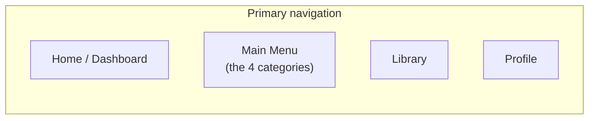

# 3. Screen Map

## 3.1 Navigation model

**Four** primary destinations, built on Expo Router so the same route tree drives
every platform — iOS, Android, and desktop web are all the full product (architecture
§2.1), not a mobile app with a companion site. An earlier draft had a separate "Learn"
tab (paths + skill tree) alongside a "Practice" tab (the Main Menu); those are now the
same thing, since Keyvoria's four categories (PRD §1.4) *are* the curriculum — there
is no longer a second, parallel "browse the curriculum" surface to keep in sync with
the Main Menu:

**Chrome is responsive, not platform-specific** (architecture §2.1a): below the
1024px breakpoint this renders as a bottom tab bar (phone-width mobile and narrow
browser windows alike); at 1024px and up it becomes a left navigation rail, and
individual screens pick up desktop-only layout — e.g. a category's Tier Ladder and the
Practice Screen use the extra horizontal room rather than staying phone-narrow with
empty margins either side. The same account, the same XP/progress/entitlements/
uploads, and the same screen inventory below apply on every platform (architecture
§2.7) — what changes with viewport width is layout, never which features exist.

Onboarding and the MIDI setup flow sit outside the tab bar (full-screen, linear).
The Learn My Music upload flow is entered from Home/Library/Main Menu but opens as
its own modal/stack flow since it has a distinct linear upload → processing → result
shape.

## 3.2 Onboarding flow (pre-tab-bar, first launch only)

1. **Welcome / value prop** — 2–3 swipeable screens.
2. **Goal selection** — "play songs I love" / "learn theory & reading" / "classical
   repertoire" / "improvise & play by ear" (feeds a recommendation of which category
   to focus on first — PRD F-06 — not a fixed path assignment).
3. **Skill assessment (skippable)** — a few quick play-along or multiple-choice
   probes (uses the on-screen keyboard if no MIDI device yet) that can grant a
   starting XP boost and/or pre-unlock an early tier in the relevant category or two,
   instead of every category always starting at tier 1.
4. **MIDI setup** — detect/pair a MIDI keyboard; explicit "I don't have one yet, use
   on-screen keyboard" fallback that doesn't dead-end the flow. A free-tier user
   choosing the fallback sees a 2-octave on-screen keyboard (PRD §1.4's Free vs.
   Premium table); this isn't a paywall moment during onboarding, just how the
   keyboard renders — the upgrade CTA lives in Profile/paywall screens, not here.
5. **Account creation** — email/social sign-in (needed to persist progress across
   devices); guest mode allowed with a clear "progress stays on this device only"
   notice, upgradeable to an account later without losing local progress.
6. → lands on **Home / Dashboard**.

## 3.3 Tab: Home / Dashboard

- **Streak + XP summary** (glanceable, top of screen) — leads with the **spendable XP
  balance** (PRD F-03), since that's the number that actually does something; the
  cosmetic Level shows alongside it, smaller, not as the headline.
- "Continue" card — resumes the last in-progress lesson/upload.
- Today's Daily Challenge card — shows its bonus-XP reward.
- **Recommended-next card** — surfaces one specific unlockable tier the user is close
  to affording (e.g. "40 XP to unlock Sight-Reading Tier 3"), across whichever
  category they've been most active in — not "next unit on a path," since there is
  no single path.
- Recent achievements strip.
- Entry point into Learn My Music (secondary, not competing with the core "continue
  learning" flow) — one entry now, not two.

## 3.4 Shared surfaces: Lesson Player & Session Summary

Used across all three tiered categories, not owned by any one of them:

- **Lesson Player** (full-screen, entered from a category's Tier Ladder or from
  Library):
  - Header: progress-through-lesson bar, exit/pause.
  - Main surface: notation/keyboard visualization appropriate to lesson type —
    falling notes or on-staff cursor for play-along; chord-symbol + listen controls
    for chord-progression steps; multiple-choice/tap surface for pure theory steps.
  - Live feedback overlay when a MIDI keyboard is active (per-note hit/miss, live
    accuracy meter) — see grading engine in the architecture doc.
- **Session Summary** screen on completion: score, XP earned, accuracy breakdown by
  skill (notes/rhythm/timing), retry vs. continue. The same family of summary screen
  closes every session type in §3.5 below (Ear Training rounds, Sight-Reading
  passages, the Repeat drill, Lesson Player lessons) with activity-appropriate detail.

## 3.5 Tab: Main Menu

The Main Menu is Keyvoria's curriculum, not just a practice-tool list — exactly
**four** tiles, one per category (PRD §1.4):

1. **Ear Training** → this category's Tier Ladder (below)
2. **Sight-Reading** → this category's Tier Ladder (below) — the drill itself has no
   setup screen, but the category still has a Tier Ladder to browse/unlock from
3. **Playback & Repeat** → this category's Tier Ladder (below)
4. **Learn My Music** *(Premium badge if not entitled)* → paywall screen if not
   entitled, otherwise the upload flow (§3.7)

There is no fifth "Warm Up"/"Free Play" tile in V1 (PRD §1.4). Every tile leads into
that category's own space and returns here on exit rather than dead-ending. This
screen is also linked from the Home dashboard, not just reachable via the tab bar,
since it's the app's most frequently used surface after "Continue."

A **Show Note Names** toggle (PRD F-02a) sits in this screen's header, not per-tile —
it's one setting that applies to every keyboard shown anywhere in the app, so it's set
once from the hub rather than re-toggled per mode.

### 3.5.1 Category Tier Ladder (shared shape, used by all three tiered categories)

Tapping Ear Training, Sight-Reading, or Playback & Repeat opens that category's own
**Tier Ladder** screen before any drill/practice screen — this is what replaced the
old cross-category "Learn tab" skill tree, scoped to one category at a time:

- A vertical list/ladder of tiers (`category_tiers`, DB §4.9b), lowest first.
  Unlocked tiers show their lessons (tap a lesson → Lesson Player, §3.4); the next
  locked tier shows its **XP cost** and an **Unlock** button — enabled when the
  user's spendable balance covers it, disabled with the shortfall shown otherwise
  (e.g. "Need 35 more XP"); tiers further out are visible but collapsed/greyed, so
  the user can see what they're saving toward without it cluttering the immediate
  decision.
- A tier gated by Premium (`required_plan = premium`) shows a lock + a **Premium**
  badge instead of an XP cost once the user has enough XP to otherwise afford it —
  distinguishing "you can't afford this yet" from "this needs Keyvoria Plus" is
  important, since they call for different next actions.
- Tapping **Unlock** on an affordable tier is a confirmation step (spending XP is
  permanent, per PRD F-03), not a silent action — a brief "Tier unlocked!" moment
  with the reveal of its lessons follows confirmation.
- For **Ear Training** and **Playback & Repeat's Repeat drill**, an unlocked tier's
  procedurally-generated drill leads into that category's own setup screen (below)
  rather than a fixed lesson list, since those configure at play time.

### 3.5.2 Ear Training

See PRD F-02a. From the Tier Ladder, the procedurally-generated drill opens:
1. **Drill Setup** — choose *Note Intervals* or *Chord Progressions*.
   - Note Intervals: a **2–8 notes** stepper (2 = interval, 3 = triad, 4–8 =
     interval-chain dictation) plus a **Difficulty 1–5** slider.
   - Chord Progressions: a 4-way multi-select chip row for chord quality —
     Major / Minor / Augmented / Diminished — plus the same Difficulty 1–5 slider.
2. **Drill Screen** — large "play stimulus" control (with a repeat/"play again"
   affordance), multiple-choice answer buttons sized to the selected quality
   pool/interval set, immediate correct/incorrect feedback per round, running
   accuracy visible throughout. Keyboard visualization (if shown) respects the Show
   Note Names setting.
3. **Session Summary** (§3.4) — overall accuracy, breakdown per interval/quality, XP
   earned, retry-with-same-config vs. change config.

### 3.5.3 Sight-Reading

See PRD F-02b. No setup screen — tapping into an unlocked Sight-Reading tier
immediately opens a passage from that tier with a randomly chosen clef badge (Treble
or Bass) at the top.
1. **Sight-Reading Screen** — curated passage rendered via the `notation` package,
   live MIDI grading overlay (this mode requires a MIDI keyboard, unlike Ear
   Training), sight-read-once by default with an optional practice-first toggle.
2. **Session Summary** (§3.4) — note accuracy and rhythm/timing breakdown.

### 3.5.4 Playback & Repeat

See PRD F-02c. This category's Tier Ladder mixes two content shapes: authored
lessons (exercises/chord progressions/classical/original songs — tap into Lesson
Player, §3.4, like any other category) and the procedurally-generated **Repeat**
drill:
1. **Difficulty Setup** — Basic / Intermediate / Advanced tier selector for the
   drill's own internal difficulty; a one-line explainer that tempo speeds up
   automatically as the sequence grows.
2. **Repeat Screen** — the app plays a growing note sequence, then the keyboard
   visualization goes into "your turn" state and waits for the matching MIDI input;
   a progress readout shows current sequence length and tempo. Ends on the first
   miss.
3. **Session Summary** (§3.4) — rounds survived, longest sequence, XP earned, retry.

### 3.5.5 Practice Screen

Shared surface reused by Sight-Reading, the Repeat drill, and Library song practice —
metronome, loop-region selector, speed control, live grading overlay.

## 3.6 Tab: Library

- **Search & filters** — text search plus filter chips (category: Ear Training /
  Sight-Reading / Playback & Repeat, difficulty, skill tag, genre, duration, content
  type: exercise / progression / classical / original song / sight-reading passage,
  completion status, tier/unlock status).
- **Result list/grid** → **Item Detail** screen (description, difficulty, which tier
  it belongs to, preview audio, "Start"/"Practice" CTA — disabled with an "Unlock in
  [Category]" prompt if the item's tier isn't unlocked yet) → Lesson Player or
  Practice Screen.
- Classical pieces and original songs get a slightly richer Item Detail (composer/era
  or original-artist attribution, public-domain/license note per F-01 licensing
  requirement).

## 3.7 Learn My Music flow (modal stack, entered from the Main Menu, Home, or Library)

See PRD F-05 for the underlying analysis/labeling requirements — Keyvoria's one
premium feature, and its only entitlement-gated flow. An earlier draft split this
into a free MIDI/MusicXML flow and a separate paid MP3 flow; V1 merges them into one.

0. **Paywall** (only shown when the user has no active entitlement) — what the
   feature does, upgrade CTA ($9.95/month, PRD §1.4). Declining returns to wherever
   the user came from; an entitled user skips straight to step 1.
1. **Upload** — pick a file: MP3 (the primary, headline format) or, where supported,
   MIDI/MusicXML (device file picker / cloud file picker).
2. **Processing** — for MIDI/MusicXML, a quick progress state while the `analysis`
   package runs difficulty scoring and section segmentation client-side
   (deterministic, fast; architecture §2.4/§2.8). For MP3, job-queued server-side
   analysis (tempo detection + best-effort transcription via `services/
   transcription`) with a clear "this can take a minute" state, since it isn't
   instant the way the symbolic path is.
3. **Mode Select** — once analysis completes, one screen with three cards, each
   launching a different way to practice the same upload:
   - **Sheet Music** — notation view (treble/bass grand staff via the `notation`
     package); on an MP3 upload, low-confidence passages are visibly flagged rather
     than rendered as if certain.
   - **Synthesia-style** — falling-notes/piano-roll practice: hands-separate toggle
     (Both / Left only / Right only), section loop selector, 0.25×–2× continuous
     speed control (YouTube-style, pitch-preserved), performance grading against the
     analysis using the shared `grading-engine` (F-02).
   - **Auto-Play** — Keyvoria plays the piece back through a synthesized piano with
     play / pause / scrub controls (pause at any moment); note highlighting on the
     visual keyboard runs alongside, reusing mode 2's rendering.
   All three share the same section loop / speed / BPM controls underneath the
   mode-specific surface; switching modes mid-session keeps the current loop region
   and playback position where meaningful. On an **MP3 upload**, all three also carry
   the same persistent **Estimated** banner (not a one-time toast) — format
   determines confidence, not entitlement (PRD F-05): MIDI/MusicXML uploads show no
   such banner, since that analysis is deterministic.
4. **Estimated Transcription panel** (MP3 uploads only, available from any of the
   three modes) — chord/note overlay clearly and persistently labeled "Estimated,"
   with a way to view/hide it and (V1-light) manually correct obviously-wrong chord
   labels.
5. Saved into **Library → "My Uploads"**, MP3-sourced items visually distinguished
   with an estimated-transcription badge from MIDI/MusicXML-sourced ones so users
   don't confuse confidence levels between upload types. Re-opening a saved upload
   returns to Mode Select, not straight into whichever mode was last used, since
   switching is a core part of this feature.

## 3.8 Achievements & Progress (reached from Profile, and from Home's achievement
strip)

- **Achievements screen** — grid of badges, earned/locked, per-badge criteria on tap.
- **Streaks screen** — calendar/heatmap view of practice days, streak-freeze status.
- **Progress Analytics screen** — two distinct views, since "how good am I" and "how
  far have I progressed" are different questions (PRD F-03):
  - Per-skill accuracy mastery bars (notes, rhythm, timing, reading, theory, ear
    training) over time, and time-practiced trends — *how good*.
  - Per-category XP balance and lifetime-spend, and an unlocked-tier ladder mini-view
    for each of Ear Training / Sight-Reading / Playback & Repeat (tap through to that
    category's full Tier Ladder, §3.5.1) — *how far*.

## 3.9 Tab: Profile

- Account info, subscription/entitlement state — gates Learn My Music (PRD F-05),
  the on-screen keyboard's range (2 octaves free / 61 keys premium, PRD §1.4), and
  each category's premium-only tiers; **Keyvoria Plus is $9.95/month** (PRD §1.4).
  This screen surfaces current entitlement state and is where the upgrade CTA lives.
- MIDI device management (paired devices, latency calibration).
- Notification preferences (daily reminder, streak-risk nudge).
- Links out to Achievements / Streaks / Progress Analytics (§3.8).
- App settings (audio output, accessibility options), support/help.

## 3.10 Full screen inventory (reference list)

Onboarding: Welcome · Goal Selection · Skill Assessment · MIDI Setup · Account Creation

Tabs: Home · Main Menu (Ear Training [Tier Ladder, Drill Setup, Drill Screen],
Sight-Reading [Tier Ladder, Sight-Reading Screen], Playback & Repeat [Tier Ladder,
Difficulty Setup, Repeat Screen], Learn My Music) · Library (Search/Filter, Item
Detail) · Profile

Shared surfaces: Lesson Player · Session Summary · Practice Screen

Upload flow: Learn My Music (Paywall, Upload, Processing, Mode Select, Sheet Music /
Synthesia-style / Auto-Play, Estimated Transcription panel)

Progress: Achievements · Streaks · Progress Analytics

Utility: Unit Preview (bottom sheet) · MIDI Device Management · Notification
Preferences · Settings
