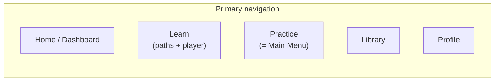

# 3. Screen Map

## 3.1 Navigation model

Bottom tab bar (mobile) / left rail (web, wide viewport) with 5 primary destinations,
built on Expo Router so the same route tree drives all platforms:

Onboarding and the MIDI setup flow sit outside the tab bar (full-screen, linear).
Upload flows (Learn My Music, Learn My Song) are entered from Home/Library/Practice
but open as their own modal/stack flow since they have a distinct linear
upload → processing → result shape.

## 3.2 Onboarding flow (pre-tab-bar, first launch only)

1. **Welcome / value prop** — 2–3 swipeable screens.
2. **Goal selection** — "play songs I love" / "learn theory & reading" / "classical
   repertoire" / "improvise & play by ear" (feeds initial path recommendation).
3. **Skill assessment (skippable)** — a few quick play-along or multiple-choice
   probes (uses the on-screen keyboard if no MIDI device yet) to place the user past
   absolute-beginner content if warranted.
4. **MIDI setup** — detect/pair a MIDI keyboard; explicit "I don't have one yet, use
   on-screen keyboard" fallback that doesn't dead-end the flow.
5. **Account creation** — email/social sign-in (needed to persist progress across
   devices); guest mode allowed with a clear "progress stays on this device only"
   notice, upgradeable to an account later without losing local progress.
6. → lands on **Home / Dashboard**.

## 3.3 Tab: Home / Dashboard

- Streak + XP/level summary (glanceable, top of screen).
- "Continue" card — resumes the last in-progress lesson/song.
- Today's Daily Challenge card.
- Recommended-next card (next unit on the active learning path).
- Recent achievements strip.
- Entry points into Learn My Music and Learn My Song (secondary, not competing with
  the core "continue learning" flow).

## 3.4 Tab: Learn

- **Path selector** — Beginner / Intermediate / Advanced / Genre-focused (per-path
  progress shown).
- **Visual learning path (skill tree)** — the primary screen of this tab: a scrollable,
  branching map of units (exercises, chord-progression lessons, theory, ear training,
  sight reading, songs) with locked/available/completed states, mirroring the
  Duolingo-style path metaphor the product is targeting.
  - Tapping a node opens **Unit Preview** (bottom sheet: what it covers, est. time,
    skill tags) → **Start** launches the Lesson Player.
- **Lesson Player** (full-screen, entered from a path node or Library):
  - Header: progress-through-lesson bar, exit/pause.
  - Main surface: notation/keyboard visualization appropriate to lesson type —
    falling notes or on-staff cursor for play-along; chord-symbol + listen controls
    for chord-progression/ear-training steps; multiple-choice/tap surface for pure
    theory steps.
  - Live feedback overlay when a MIDI keyboard is active (per-note hit/miss, live
    accuracy meter) — see grading engine in the architecture doc.
  - **Session Summary** screen on completion: score, XP earned, accuracy breakdown by
    skill (notes/rhythm/timing), retry vs. continue.

## 3.5 Tab: Practice — Main Menu

The Practice tab's home screen *is* the app's **Main Menu**: a single hub screen with
one tile per training session type, so nothing is buried under a generic label. Tiles:

- **Ear Training** → Drill Setup (below)
- **Sight Reading** → clef selector (below)
- **Chord Progression Trainer** → pick/roll a progression, play along with adjustable
  tempo and a "show me the chord" hint toggle
- **Learn My Song** → the MP3/audio upload flow (§3.8a)
- **Warm Up** → auto-picks a couple of recently-practiced exercises, no setup needed
- **Free Play** → metronome-only, no grading target

Each tile opens straight into that mode's setup step (no extra menu layer), and each
mode returns to this Main Menu on exit rather than dead-ending. This is also linked
from the Home dashboard, not just reachable via the tab bar, since it's the app's most
frequently used surface after "Continue."

- **Ear Training** — see PRD F-02a for the full spec. Flow:
  1. **Drill Setup** — choose *Note Intervals* or *Chord Progressions*.
     - Note Intervals: a **2–8 notes** stepper (2 = interval, 3 = triad, 4–8 =
       interval-chain dictation) plus a **Difficulty 1–5** slider.
     - Chord Progressions: a 4-way multi-select chip row for chord quality —
       Major / Minor / Augmented / Diminished — plus the same Difficulty 1–5 slider.
  2. **Drill Screen** — large "play stimulus" control (with a repeat/"play again"
     affordance), multiple-choice answer buttons sized to the selected quality
     pool/interval set, immediate correct/incorrect feedback per round, running
     accuracy visible throughout.
  3. **Session Summary** — same family as the Lesson Player's summary screen: overall
     accuracy, breakdown per interval/quality, XP earned, retry-with-same-config vs.
     change config.
- **Sight Reading** — see PRD F-02b. Flow:
  1. **Clef Setup** — Treble / Bass / Grand Staff selector, plus difficulty filter.
  2. **Sight Reading Screen** — curated passage rendered via the `notation` package,
     live MIDI grading overlay (this mode requires a MIDI keyboard, unlike Ear
     Training), sight-read-once by default with an optional practice-first toggle.
  3. **Session Summary** — note accuracy and rhythm/timing breakdown, same family as
     above.
- **Practice Screen** (shared surface used by Chord Progression Trainer, Warm Up, and
  Library song practice) — metronome, loop-region selector, speed control, live
  grading overlay.

## 3.6 Tab: Library

- **Search & filters** — text search plus filter chips (difficulty, skill tag, genre,
  duration, content type: exercise / progression / classical / original song /
  sight-reading passage,
  completion status).
- **Result list/grid** → **Item Detail** screen (description, difficulty, preview
  audio, "Start"/"Practice" CTA) → Lesson Player or Practice Screen.
- Classical pieces and original songs get a slightly richer Item Detail (composer/era
  or original-artist attribution, public-domain/license note per F-01 licensing
  requirement).

## 3.7 Learn My Music flow (modal stack, entered from Home/Library/Practice)

1. **Upload** — pick a MIDI or MusicXML file (device file picker / cloud file picker).
2. **Processing** — progress state while `analysis` package runs difficulty scoring
   and section segmentation (client-side for MIDI/MusicXML since it's deterministic
   and fast; see architecture §2.4/§2.8).
3. **Tutorial Overview** — generated difficulty rating, estimated practice time,
   detected sections (for looping), hands-separate availability.
4. **Tutorial Player** — same Lesson-Player-family surface, plus:
   - Hands: Both / Left only / Right only toggle.
   - Section loop selector (auto-segmented, user-adjustable boundaries).
   - Speed control: 25% / 50% / 75% / 100%.
   - Performance grading against the uploaded score, same feedback model as F-02.
5. Saved into **Library → "My Uploads"** for repeat practice; also surfaces on Home
   "Continue" if in progress.

## 3.8a Learn My Song flow (modal stack, entered from the Main Menu, Home, or Library)

See PRD F-06 for the underlying analysis/labeling requirements.

1. **Upload** — pick an audio file (typically MP3).
2. **Processing** — job-queued server-side analysis (tempo detection + best-effort
   transcription via `services/transcription`); shows a clear "this can take a
   minute" state since it's not instant like the MIDI/MusicXML path.
3. **Mode Select** — once processing completes, one screen with three cards, each
   launching a different way to learn the same transcription:
   - **Sheet Music** — notation view (treble/bass grand staff via the `notation`
     package); low-confidence passages are visibly flagged rather than rendered as
     if certain.
   - **Synthesia-style** — falling-notes/piano-roll practice: hands-separate toggle,
     section loop selector, 25/50/75/100% speed control, performance grading against
     the transcription — the same surface family as F-05's Tutorial Player.
   - **Auto-Play** — the app plays the transcribed performance through a synthesized
     piano with play / pause / scrub controls (pause at any moment); note highlighting
     on the visual keyboard runs alongside, reusing mode 2's rendering.
   All three share the same **Estimated Transcription** banner (persistent, not a
   toast) and the same section loop / speed / BPM controls underneath the mode-
   specific surface; switching modes mid-session keeps the current loop region and
   playback position where meaningful.
4. **Estimated Transcription panel** (available from any of the three modes) —
   chord/note overlay clearly and persistently labeled "Estimated," with a way to
   view/hide it and (V1-light) manually correct obviously-wrong chord labels.
5. Saved into **Library → "My Uploads"** alongside Learn My Music items, visually
   distinguished (estimated-transcription badge) so users don't confuse confidence
   levels between the two upload types. Re-opening a saved upload returns to Mode
   Select, not straight into whichever mode was last used, since switching is a core
   part of this feature.

## 3.9 Achievements & Progress (reached from Profile, and from Home's achievement
strip)

- **Achievements screen** — grid of badges, earned/locked, per-badge criteria on tap.
- **Streaks screen** — calendar/heatmap view of practice days, streak-freeze status.
- **Progress Analytics screen** — per-skill mastery bars (notes, rhythm, timing,
  reading, theory, ear training) over time; time-practiced trends; path completion %.

## 3.10 Tab: Profile

- Account info, subscription/entitlement state (schema supports this even if V1 is
  free — see PRD §1.6 open decision).
- MIDI device management (paired devices, latency calibration).
- Notification preferences (daily reminder, streak-risk nudge).
- Links out to Achievements / Streaks / Progress Analytics (§3.9).
- App settings (audio output, accessibility options), support/help.

## 3.11 Full screen inventory (reference list)

Onboarding: Welcome · Goal Selection · Skill Assessment · MIDI Setup · Account Creation

Tabs: Home · Learn (Path Selector, Skill Tree) · Practice/Main Menu (Chord Trainer,
Ear Training [Drill Setup, Drill Screen], Sight Reading [Clef Setup, Sight Reading
Screen], Warm Up, Free Play) · Library (Search/Filter, Item Detail) · Profile

Shared surfaces: Lesson Player · Session Summary · Practice Screen

Upload flows: Learn My Music (Upload, Processing, Tutorial Overview, Tutorial Player) ·
Learn My Song (Upload, Processing, Mode Select, Sheet Music / Synthesia-style /
Auto-Play, Estimated Transcription panel)

Progress: Achievements · Streaks · Progress Analytics

Utility: Unit Preview (bottom sheet) · MIDI Device Management · Notification
Preferences · Settings
