# 4. Database Structure

PostgreSQL (via Supabase, per architecture §2.6). This document defines the V1 schema
at the entity/field level; exact migration files are a Milestone 1 deliverable.
Conventions: every table has `id uuid primary key default gen_random_uuid()`,
`created_at`/`updated_at timestamptz`, soft-deletes only where noted.

## 4.1 Entity-relationship overview

```mermaid
erDiagram
    USERS ||--o{ USER_PROGRESS : has
    USERS ||--o{ ATTEMPTS : makes
    USERS ||--o{ XP_EVENTS : earns
    USERS ||--o{ USER_ACHIEVEMENTS : unlocks
    USERS ||--|| STREAKS : has
    USERS ||--o{ USER_UPLOADS : uploads
    USERS ||--|| USER_LEVEL : has
    USERS ||--o{ DAILY_CHALLENGE_PROGRESS : tracks

    CATEGORY_TIERS ||--o{ LESSONS : unlocks
    CATEGORY_TIERS ||--o{ USER_CATEGORY_UNLOCKS : "purchased as"
    USERS ||--o{ USER_CATEGORY_UNLOCKS : purchases

    LESSONS ||--o{ ATTEMPTS : "attempted via"
    LESSONS }o--o{ TAGS : tagged

    LESSONS ||--o| EXERCISES : "type: exercise"
    LESSONS ||--o| SIGHT_READING_PASSAGES : "type: sight_reading"
    LESSONS ||--o| CHORD_PROGRESSION_LESSONS : "type: progression"
    LESSONS ||--o| SONGS : "type: song"

    CHORD_PROGRESSION_LESSONS }o--|| CHORD_PROGRESSIONS : uses

    SONGS ||--o{ SONG_SECTIONS : "segmented into"
    SONGS ||--o{ MEDIA_ASSETS : has

    ACHIEVEMENTS ||--o{ USER_ACHIEVEMENTS : "unlocked as"
    DAILY_CHALLENGES ||--o{ DAILY_CHALLENGE_PROGRESS : tracked_by

    USER_UPLOADS ||--o| GENERATED_TUTORIALS : produces
    GENERATED_TUTORIALS ||--o{ TUTORIAL_SECTIONS : "segmented into"
    GENERATED_TUTORIALS ||--o{ ATTEMPTS : "attempted via"

    EAR_TRAINING_DRILLS ||--o| LESSONS : "curated as (optional)"
    EAR_TRAINING_DRILLS ||--o{ EAR_TRAINING_SESSIONS : "played as"
    USERS ||--o{ EAR_TRAINING_SESSIONS : plays
    EAR_TRAINING_SESSIONS ||--o{ EAR_TRAINING_ROUNDS : contains

    USERS ||--o{ REPEAT_SESSIONS : plays
    REPEAT_SESSIONS ||--o{ REPEAT_ROUNDS : contains

    USERS ||--o{ ENTITLEMENTS : has
    USERS ||--o{ SUBSCRIPTIONS : "billed via"
    SUBSCRIPTIONS ||--o| ENTITLEMENTS : grants

    USERS ||--o{ PRACTICE_INTERVALS : accrues
    USERS ||--|| USER_STATS : "rolled up into"
```

## 4.2 Identity & account

**`users`**
`id`, `email`, `display_name`, `auth_provider`, `created_at`, `last_active_at`,
`onboarding_completed_at`, `initial_goal` (enum: play_songs / theory_reading /
classical / improvise), `is_guest` (bool), `show_note_names` (bool, default false —
the Main Menu's global keyboard-label toggle from PRD F-02a; one setting, read by
every screen that renders a keyboard, not reconfigured per session).

**`entitlements`**
`id`, `user_id → users`, `plan` (enum: free / trial / paid — `paid` means an active
Keyvoria Plus subscription, $9.95/month per PRD §1.4), `starts_at`, `expires_at`.
This table answers only "what can this user access right now," so it stays small and
fast — it is read on nearly every gated action. The commercial state behind it
(provider, renewal date, cancellation) lives in `subscriptions` (§4.10b); cancelling
changes that table, and only the period-end job changes this one.
Gates three things: F-05 Learn My Music in full (see `generated_tutorials` §4.11 for
exactly where that check happens — every upload type now, not just audio), the
on-screen keyboard's key range (the shared component reads `plan` at mount —
`plan = free` → 2 octaves, otherwise → 61 keys, not a value stored per-user
elsewhere; note this gates *range only*, never the keyboard's presence, which is
unconditional on every play screen per PRD F-02), and every category's **tier 4**
(`category_tiers.required_plan = premium`, §4.9b) — a free user can hold any amount
of unspent XP and still can't purchase tier 4 without an active `paid` plan.

**`midi_devices`**
`id`, `user_id → users`, `device_name`, `transport` (usb / bluetooth), `last_connected_at`,
`measured_latency_ms` (nullable, from calibration flow).

## 4.3 Content

**`category_tiers`** — see §4.9b for the full spec (kept there, next to the XP
economy it powers, rather than here — cross-referenced from `lessons` below since
every curated lesson belongs to one).

**`lessons`**
`id`, `slug`, `title`, `type` (enum: exercise / chord_progression / theory /
ear_training / sight_reading / song), `tier_id → category_tiers` (**not** nullable —
every curated lesson belongs to exactly one category tier; there is no
"unattached" curated content in V1's model, per PRD F-01/F-03), `difficulty`
(1–10 int, fine-grained ordering *within* a tier — tiers are the coarse XP-unlock
boundary, `difficulty` is the finer sequencing inside one), `est_duration_seconds`,
`skill_focus` (text[] — e.g. `{rhythm, left_hand, chord_voicing}`), `description`,
`is_published`. Type-specific detail lives in the linked table (`exercises` §4.4,
`sight_reading_passages` §4.4a, `chord_progression_lessons` §4.5, `songs` §4.6, or
`ear_training_drills` §4.9 for the `ear_training` type) via `lessons.detail_id` +
`type`, not a giant nullable-column table.

**`tags`** / **`lesson_tags`** (join table `lesson_id`, `tag_id`) — powers Library
search/filter facets independent of `skill_focus` (tags are curator-facing/searchable;
`skill_focus` drives the Progress Analytics mastery breakdown).

### 4.4 Exercises

**`exercises`**
`id`, `lesson_id → lessons`, `midi_reference_asset_id → media_assets` (the expected
note/timing sequence the grading engine plays against), `instructions_md`,
`hand` (enum: left / right / both).

### 4.4a Sight reading passages

Supports PRD F-02b. Unlike ear training, these are curated content (like exercises),
not procedurally generated.

**`sight_reading_passages`**
`id`, `lesson_id → lessons`, `clef` (enum: treble / bass / grand_staff),
`musicxml_asset_id → media_assets`, `midi_reference_asset_id → media_assets`
(expected note/timing sequence for grading, same role as
`exercises.midi_reference_asset_id`), `measure_count`, `difficulty` (1–10). The Main
Menu's Sight-Reading tile (screen map §3.3) queries `WHERE clef IN ('treble', 'bass')
AND lesson.tier_id IN <the user's currently-unlocked Sight-Reading tiers>` and picks
one at random — `grand_staff` passages exist in this table for tiers that
deliberately combine both clefs but aren't in that quick-launch pool, since PRD F-02b
only randomizes between the two single-clef options.

### 4.5 Chord progressions

**`chord_progressions`**
`id`, `slug`, `name` (e.g. "ii–V–I in C"), `roman_numerals` (text[]),
`key_signature`, `time_signature`, `midi_reference_asset_id → media_assets`.

**`chord_progression_lessons`**
`id`, `lesson_id → lessons`, `progression_id → chord_progressions`, `stage` (enum:
theory_explainer / listen_identify / play_along), `content_md`.

### 4.6 Songs (classical + original)

**`songs`**
`id`, `lesson_id → lessons` (every song belongs to a Playback & Repeat tier, per
§4.3's `lessons.tier_id`), `title`, `composer_or_artist`, `era` (nullable, classical
only), `category` (enum: classical_public_domain / original), `license_type` (enum:
public_domain / owned_original), `license_source_note` (text — PD edition citation, or
"composed in-house"), `musicxml_asset_id → media_assets`,
`midi_reference_asset_id → media_assets`, `audio_preview_asset_id → media_assets`.

**`song_sections`**
`id`, `song_id → songs`, `label` (e.g. "A section", "Verse 1"), `start_measure`,
`end_measure`, `sort_order` — powers the loop-region selector on the Practice Screen.

### 4.7 Media

**`media_assets`**
`id`, `kind` (enum: musicxml / midi / audio_preview), `storage_path`, `mime_type`,
`size_bytes`, `checksum`.

## 4.8 Progress, attempts, and grading history

**`user_progress`**
`id`, `user_id → users`, `lesson_id → lessons` (nullable), `generated_tutorial_id →
generated_tutorials` (nullable — exactly one of these two is set), `status` (enum:
not_started / in_progress / completed), `best_score` (0–100), `last_attempt_at`.
Unique on `(user_id, lesson_id)` and `(user_id, generated_tutorial_id)`.

**`attempts`**
`id`, `user_id → users`, `lesson_id → lessons` (nullable),
`generated_tutorial_id → generated_tutorials` (nullable), `started_at`, `completed_at`,
`accuracy_notes` (0–100), `accuracy_rhythm` (0–100), `accuracy_timing` (0–100),
`overall_score` (0–100), `note_events` (jsonb — the per-note hit/miss/early/late
detail from the grading engine, kept for the Progress Analytics breakdown and for
potential replay/review UI later), `input_source` (enum: midi_hardware / on_screen —
every lesson type is playable with either surface, per PRD F-02, and the two grade
under different timing tolerances, so the attempt records which one produced it).

## 4.9 Ear training drills

Supports PRD F-02a. Unlike exercises/songs/progressions, most sessions here are
user-configured at play time rather than pre-authored, so the schema models a
*drill configuration* plus a *played session* separately.

**`ear_training_drills`**
`id`, `lesson_id → lessons` (nullable — set only for curated, tier-linked stops
within the Ear Training category; null for an ad-hoc config the user assembles from
the Main Menu, which spends no XP and unlocks nothing), `drill_type` (enum:
interval / chord_progression), `stimulus_note_count` (int, 2–8, applicable when
`drill_type = interval` — 2 = two-note interval, 3 = triad graded by chord quality,
4–8 = melodic interval-chain dictation), `allowed_qualities` (text[], subset of
`{major, minor, augmented, diminished}` — applicable when `drill_type =
chord_progression`, or when `drill_type = interval` and `stimulus_note_count = 3`),
`progression_length` (int, nullable — number of chords in sequence, applicable when
`drill_type = chord_progression`), `difficulty_level` (int, 1–5 — the user-facing
Difficulty dial from PRD F-02a; for curated, `lesson_id`-linked drills, the linked
`lessons.tier_id` is what actually gates access — this field is the *internal*
difficulty dial within an already-unlocked drill, distinct from the XP-cost tier
gate). A row is created for every session, curated or ad hoc, so
`ear_training_sessions` always has exactly one `drill_id` to reference regardless of
where the config came from.

**`ear_training_sessions`**
`id`, `user_id → users`, `drill_id → ear_training_drills`, `started_at`,
`completed_at`, `total_rounds`, `correct_count`, `accuracy` (0–100). This is the
per-session analog of `attempts` for this drill family; XP is awarded per session via
an `ear_training_session_complete` `xp_events.source` value (§4.10), referencing this
table rather than `attempts`.

**`ear_training_rounds`**
`id`, `session_id → ear_training_sessions`, `round_index`, `stimulus` (jsonb — the
generated notes/chord-quality sequence actually played, e.g.
`{"note_a": "C4", "note_b": "E4"}` for a 2-note interval, `{"root": "C4", "quality":
"minor"}` for a triad, `{"notes": ["C4", "E4", "G4", "B4", "D5"]}` for a 5-note
interval-chain dictation round, or `{"chords": [{"root": "C4", "quality": "major"},
{"root": "G4", "quality": "diminished"}]}` for a progression — generated at runtime by
the `core-theory` package, not pre-authored content), `correct_answer` (for
interval-chain rounds, the ordered list of interval names between consecutive notes),
`user_answer`, `is_correct`, `response_time_ms`.

### 4.9a Playback & Repeat: the Repeat drill

Supports PRD F-02c's procedurally-generated half of the Playback & Repeat category
(the authored half — exercises, chord progressions, songs — uses the ordinary
`exercises`/`chord_progression_lessons`/`songs` tables above, all linked into this
category's tiers via `lessons.tier_id`). A session is graded round-by-round via the
`grading-engine`, same as Sight-Reading and Exercises — against **live input from
either source**, hardware MIDI or the on-screen keyboard (PRD F-02), which is why
`repeat_rounds.note_events` below carries an input-source discriminator rather than
assuming hardware.

**`repeat_drills`**
`id`, `lesson_id → lessons` (nullable, same curated-vs-ad-hoc pattern as
`ear_training_drills` — set only when this specific drill config is the thing gating
a Playback & Repeat tier), `difficulty_tier` (enum: basic / intermediate / advanced),
`starting_tempo_bpm`, `tempo_ramp_bpm_per_round` (how much playback speeds up each
time the sequence grows by a note — set per tier, so Advanced ramps faster than
Basic per PRD F-02c).

**`repeat_sessions`**
`id`, `user_id → users`, `drill_id → repeat_drills`, `started_at`, `ended_at`,
`rounds_survived`, `longest_sequence_length`, `ended_reason` (enum: missed_note /
wrong_timing / quit). No `accuracy` column here unlike `ear_training_sessions` —
a Repeat session doesn't have a fixed round count to score a percentage against, it
just ends on the first miss, so `rounds_survived` is the score.

**`repeat_rounds`**
`id`, `session_id → repeat_sessions`, `round_index`, `sequence` (jsonb — the full
note sequence played this round, one note longer than the previous round),
`tempo_bpm`, `note_events` (jsonb, same per-note hit/miss/early/late shape as
`attempts.note_events` — this is what the live input was graded against),
`input_source` (enum: midi_hardware / on_screen — recorded per round because
on-screen input is graded with wider timing tolerances and no velocity, per PRD
F-02; keeping it here means analytics can compare the two without guessing),
`passed` (bool).

### 4.9b The XP economy: category tiers & unlock purchases

Supports PRD F-03 — the schema for "XP is a currency, not a score." Two tables, kept
next to the drill/content tables above rather than inside §4.10 Gamification, since
they're as much a *content-organization* structure (what tier does a lesson belong
to) as a gamification one.

**`category_tiers`**
`id`, `category` (enum: ear_training / sight_reading / playback_repeat — exactly
Keyvoria's three tiered categories; Learn My Music has no tier ladder, it's gated
purely by `entitlements`, §4.11), `tier_number` (int, **1–4** — every category has
exactly four tiers, per PRD §1.4), `title`, `description`, `xp_cost` (int),
`required_plan` (enum: free / premium). Unique on `(category, tier_number)`. Every
curated `lessons` row (§4.3) belongs to exactly one of these via `lessons.tier_id`.

The tier rule is uniform across all three categories, and seed data must satisfy it
(worth a CHECK constraint or a seed-validation test, since the whole pricing story
depends on it holding):

| `tier_number` | `xp_cost` | `required_plan` | Unlocked how |
|---|---|---|---|
| 1 | `0` | `free` | Pre-unlocked for every user; no purchase row needed |
| 2 | > 0 | `free` | XP purchase |
| 3 | > 0 (more than tier 2) | `free` | XP purchase |
| 4 | > 0 (most expensive) | `premium` | XP purchase **and** active Keyvoria Plus |

Tier 4 is what PRD F-03 calls "premium sits on top of XP, not instead of it": it
still costs `xp_cost` XP *and* requires the entitlement. It's also the only tier
whose content may exceed the 2-octave range, which is why it pairs with the 61-key
keyboard the same subscription unlocks.

**`user_category_unlocks`**
`id`, `user_id → users`, `tier_id → category_tiers`, `xp_spent` (int — a snapshot of
`category_tiers.xp_cost` at purchase time, so a later cost-curve rebalance in content
production doesn't retroactively rewrite what a past purchase "cost"), `unlocked_at`.
Unique on `(user_id, tier_id)`. Purchasing is a single transaction: verify the user's
current balance covers `xp_cost` (and, if `required_plan = premium`, verify
`entitlements`), insert this row, and from that point every lesson under that tier is
accessible. This never happens automatically on lesson completion — it's a deliberate
action the user takes from that category's tier-ladder screen (screen map §3.3).

**Computing a user's spendable XP balance** — never stored directly, always
`sum(xp_events.amount) − sum(user_category_unlocks.xp_spent)` for that user,
computed server-side at request time (or cached briefly, never trusted from a
client), same never-trust-the-client rule that already governs `xp_events` below.
This is distinct from **lifetime XP** (`sum(xp_events.amount)` alone, with nothing
subtracted), which is what the purely-cosmetic Level (`user_level`, §4.10) is derived
from — spending XP on an unlock doesn't demote a user's Level, since Level reflects
effort put in, not currency currently on hand.

## 4.10 Gamification

**`xp_events`**
The **earning** ledger only — spending is tracked separately in
`user_category_unlocks` (§4.9b), not as a negative row here, so this table never
needs negative `amount` values and always reads as "here's everything a user has
ever earned."
`id`, `user_id → users`, `attempt_id → attempts` (nullable),
`ear_training_session_id → ear_training_sessions` (nullable — set instead of
`attempt_id` for §4.9 sessions), `repeat_session_id → repeat_sessions` (nullable —
set instead of `attempt_id` for §4.9a sessions; a session with `show_note_names` on
still generates one of these per PRD F-02a — the toggle changes nothing about how XP
is earned), `source` (enum: lesson_complete / daily_challenge / achievement /
streak_bonus / ear_training_session_complete / repeat_session_complete), `amount`,
`created_at`. Both a user's spendable balance and lifetime total are always computed
from this table server-side (§4.9b) — never a client-writable counter (per
architecture §2.7).

**`user_level`**
`user_id → users` (PK), `current_level`, `current_xp_into_level` — derived purely
from **lifetime** XP (`sum(xp_events.amount)`, unaffected by spending), recomputed by
the same job that inserts events. This is explicitly **cosmetic** (PRD F-03) — it
gates nothing in the app; the real progression state is per-category unlocked tiers
(`user_category_unlocks`, §4.9b). Kept as its own small table (rather than computed
on every read) purely for fast dashboard reads.

**`streaks`**
`user_id → users` (PK), `current_streak_days`, `longest_streak_days`,
`last_practice_date`, `freezes_available`, `freezes_used_total`.

**`achievements`**
`id`, `slug`, `title`, `description`, `icon_asset`, `criteria` (jsonb — rule
definition evaluated by the `gamification` package, e.g.
`{"type": "streak_reached", "days": 30}` or `{"type": "tier_unlocked", "category":
"sight_reading", "tier_number": 3}`).

**`user_achievements`**
`id`, `user_id → users`, `achievement_id → achievements`, `unlocked_at`. Unique on
`(user_id, achievement_id)`.

**`daily_challenges`**
`id`, `challenge_date` (date, unique), `lesson_id → lessons` (nullable),
`generated_selection_rule` (jsonb, for auto-picked-per-user challenges if V1 does
personalized rather than global-per-day challenges — **DECISION NEEDED:** confirm
whether the daily challenge is the same for all users on a given date or personalized;
schema supports either, but it changes how `daily_challenges` vs.
`daily_challenge_progress` are populated).

**`daily_challenge_progress`**
`id`, `user_id → users`, `daily_challenge_id → daily_challenges`, `completed_at`,
`attempt_id → attempts`.

## 4.10a Practice time (Profile's "total hours")

Supports PRD F-07's headline stat. Every session type already carries start/end
timestamps (`attempts`, `ear_training_sessions`, `repeat_sessions`), so raw duration
is derivable — but two problems make a naive `sum(ended_at - started_at)` the wrong
answer, and both are why this gets its own structure:

1. **Idle time inflates it.** A session left open while the user walks away would
   count. Practice time must be *active* time.
2. **Summing three tables on every Profile load is wasteful**, and gets worse as
   history grows — Profile is a frequently-visited tab.

**`practice_intervals`**
`id`, `user_id → users`, `category` (enum, nullable — null for Learn My Music and
Library practice, which sit outside the three tiered categories), `source_type`
(enum: attempt / ear_training_session / repeat_session / learn_my_music),
`source_id` (uuid, the row in whichever table above), `started_at`, `ended_at`,
`active_seconds` (int). Written once when a session closes.

`active_seconds` is **not** `ended_at − started_at`: the client accumulates it while
the session is actually receiving input or presenting a stimulus, and pauses
accumulation after an idle timeout (suggest 90s of no interaction, tuned in QA) and
whenever the app is backgrounded. It is also clamped server-side to the wall-clock
span, so a buggy or tampered client cannot report more active time than elapsed.

**`user_stats`**
`user_id → users` (PK), `total_active_seconds`, `total_active_seconds_by_category`
(jsonb), `lifetime_xp`, `sessions_completed`, `updated_at`. A rollup maintained
incrementally as each `practice_intervals` row lands, so Profile reads one row.
Rebuildable from `practice_intervals` + `xp_events` at any time — it is a cache, never
a source of truth, and a periodic job re-derives it to catch drift.

`lifetime_xp` is duplicated here (it is also `sum(xp_events.amount)`) for the same
read-performance reason as `user_level`, and under the same rule: any *decision* —
what a user can afford, whether an unlock is permitted — reads the ledger, never this
table (§4.9b).

## 4.10b Subscriptions & billing state

Supports PRD F-07's subscription management. `entitlements` (§4.2) answers "what can
this user access right now" and stays deliberately small and fast, since it is checked
on nearly every gated action. This table answers the separate question of "what is the
state of their commercial relationship," which is where cancellation lives.

**`subscriptions`**
`id`, `user_id → users`, `provider` (enum: stripe / apple_app_store / google_play),
`provider_subscription_id` (text — the id in that provider's system),
`purchase_platform` (enum: web / ios / android — where it was bought, which
determines where it can be cancelled), `status` (enum: active / trialing /
cancel_pending / expired / grace_period / billing_retry), `price_cents` (`995` for
Keyvoria Plus at $9.95/month), `currency`, `current_period_start`, `current_period_end`,
`cancel_at_period_end` (bool), `cancelled_at` (nullable — when the user *requested*
cancellation, distinct from when access ends), `created_at`, `updated_at`.

Notes that matter for the cancel flow:

- **Cancellation sets `cancel_at_period_end = true`; it does not touch
  `entitlements`.** Access continues until `current_period_end`, at which point the
  provider webhook moves `status` to `expired` and a job downgrades `entitlements.plan`
  to `free`. This is what makes "Plus until 14 March" truthful rather than a UI
  fiction. Resuming before that date clears the flag with no billing event at all.
- **Only `provider = stripe` can be cancelled by our backend.** Apple and Google own
  their subscriptions; there is no server-side cancel API for them, so the app
  deep-links to their management surfaces and waits for the webhook. `purchase_platform`
  is what the Profile screen reads to decide which of those it is showing (screen map
  §3.8.1).
- **Webhooks are the source of truth for `status`,** not client reports — a client
  saying "I cancelled" is a hint to refetch, never an authority to downgrade.
- **A row is never deleted on cancellation.** History is kept, so a resubscribing user
  is recognizable as returning and their prior period is auditable. Multiple rows per
  user are expected over time; the current one is the row with the latest
  `current_period_end`.
- **Downgrading never destroys user data** (PRD F-07): `xp_events`,
  `user_category_unlocks` for tiers 1-3, `user_progress`, `streaks`, and
  `generated_tutorials`/uploaded files all survive. The only effect of an expired
  entitlement is gating — tier 4 becomes unpurchasable/unenterable, the keyboard
  renders 2 octaves, Learn My Music locks. Resubscribing restores access with nothing
  to rebuild.

## 4.11 Learn My Music

Every upload type here (`midi` / `musicxml` / `audio`) is gated the same way now —
PRD F-05 is one unified premium feature, not a free-MIDI/paid-audio split. The API
checks `entitlements` (§4.2) for the requesting user before accepting *any* upload or
serving a `generated_tutorials` row, regardless of `upload_type`.

**`user_uploads`**
`id`, `user_id → users`, `upload_type` (enum: midi / musicxml / audio),
`original_filename`, `storage_path`, `status` (enum: processing / ready / failed),
`created_at`.

**`generated_tutorials`**
`id`, `user_upload_id → user_uploads`, `title` (from filename or embedded metadata),
`difficulty_rating` (1–10, from the `analysis` package heuristic), `difficulty_factors`
(jsonb — note density, hand span, tempo, chord complexity breakdown, kept for
transparency/debuggability of the rating), `detected_tempo_bpm`, `hands_separate_available`
(bool), `is_estimated` (bool — **true for audio-sourced tutorials, false for
MIDI/MusicXML-sourced**; this is the field the UI's "Estimated" badge reads from, per
PRD F-05 — format determines confidence, not entitlement, since both formats are
premium now), `sheet_music_available` (bool — false when transcription confidence is
too low to render notation responsibly; gates whether the Sheet Music mode card in
the screen map's Mode Select is enabled or shown disabled with an explanation. The
Synthesia-style and Auto-Play modes have no equivalent gate — they degrade
gracefully with a rougher transcription in a way that mis-rendered notation cannot).

**`tutorial_sections`**
`id`, `generated_tutorial_id → generated_tutorials`, `label`, `start_time_ms`,
`end_time_ms` (audio-sourced) or `start_measure`/`end_measure` (symbolic-sourced),
`sort_order` — same role as `song_sections` but for user-generated content; kept as a
separate table rather than unifying with `song_sections` since the two have different
population pipelines (curated authoring vs. auto-segmentation) even though the
Practice Screen consumes both through the same loop-selector UI.

**`estimated_chord_labels`** *(audio uploads only)*
`id`, `generated_tutorial_id → generated_tutorials`, `start_time_ms`, `end_time_ms`,
`chord_label`, `confidence` (0–1, from the transcription model), `user_corrected`
(bool) — supports the "manually correct obviously-wrong chord labels" interaction from
the screen map's Learn My Music flow.

## 4.12 Search

V1 uses Postgres full-text search (`tsvector` generated column on
`lessons.title || songs.title || tags`) rather than standing up a separate search
service — sufficient for a catalog on the order of low hundreds of items at V1 scale.
Revisit only if Library search quality/performance becomes a problem post-launch.
