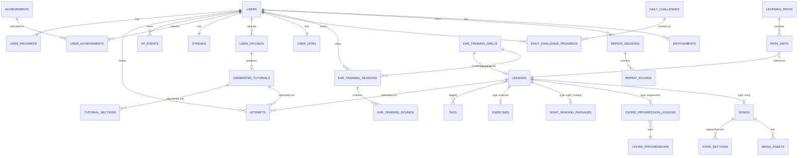

# 4. Database Structure

PostgreSQL (via Supabase, per architecture §2.6). This document defines the V1 schema
at the entity/field level; exact migration files are a Milestone 1 deliverable.
Conventions: every table has `id uuid primary key default gen_random_uuid()`,
`created_at`/`updated_at timestamptz`, soft-deletes only where noted.

## 4.1 Entity-relationship overview

## 4.2 Identity & account

**`users`**
`id`, `email`, `display_name`, `auth_provider`, `created_at`, `last_active_at`,
`onboarding_completed_at`, `initial_goal` (enum: play_songs / theory_reading /
classical / improvise), `is_guest` (bool), `show_note_names` (bool, default false —
the Main Menu's global keyboard-label toggle from PRD F-02a; one setting, read by
every screen that renders a keyboard, not reconfigured per session).

**`entitlements`**
`id`, `user_id → users`, `plan` (enum: free / trial / paid), `starts_at`, `expires_at`.
Gates PRD F-06 (Learn My Song is V1's only feature this checks — see
`generated_tutorials` §4.11 for exactly where); the specific paid plan mechanic is
still open (PRD §1.6), but the table and the check against it are both now live rather
than stubbed.

**`midi_devices`**
`id`, `user_id → users`, `device_name`, `transport` (usb / bluetooth), `last_connected_at`,
`measured_latency_ms` (nullable, from calibration flow).

## 4.3 Content

**`learning_paths`**
`id`, `slug`, `title`, `level` (enum: beginner / intermediate / advanced / genre),
`genre` (nullable, e.g. "jazz", "pop_rock" — set only when `level = genre`),
`description`, `sort_order`, `is_published`.

**`path_units`**
`id`, `path_id → learning_paths`, `lesson_id → lessons`, `sort_order`,
`unlock_rule` (jsonb — e.g. `{"requires_unit_ids": [...]}`, evaluated for the
skill-tree lock/unlock state).

**`lessons`**
`id`, `slug`, `title`, `type` (enum: exercise / chord_progression / theory /
ear_training / sight_reading / song), `difficulty` (1–10 int), `est_duration_seconds`,
`skill_focus` (text[] — e.g. `{rhythm, left_hand, chord_voicing}`), `description`,
`is_published`. Type-specific detail lives in the linked table (`exercises` §4.4,
`sight_reading_passages` §4.4a, `chord_progression_lessons` §4.5, `songs` §4.6, or
`ear_training_drills` §4.9 for the `ear_training` type) via `lessons.detail_id` +
`type`, not a giant nullable-column table.

**`tags`** / **`lesson_tags`** (join table `lesson_id`, `tag_id`) — powers Library
search/filter facets independent of `skill_focus` (tags are curator-facing/searchable;
`skill_focus` drives the Progress Analytics mastery breakdown).

### 4.4 Exercises

**`exercises`**
`id`, `lesson_id → lessons`, `midi_reference_asset_id → media_assets` (the expected
note/timing sequence the grading engine plays against), `instructions_md`,
`hand` (enum: left / right / both).

### 4.4a Sight reading passages

Supports PRD F-02b. Unlike ear training, these are curated content (like exercises),
not procedurally generated.

**`sight_reading_passages`**
`id`, `lesson_id → lessons` (nullable — same standalone-vs-path-linked pattern as
`songs`), `clef` (enum: treble / bass / grand_staff), `musicxml_asset_id →
media_assets`, `midi_reference_asset_id → media_assets` (expected note/timing
sequence for grading, same role as `exercises.midi_reference_asset_id`),
`measure_count`, `difficulty` (1–10). The Main Menu's Sight Reading tile (screen map
§3.5) queries `WHERE clef IN ('treble', 'bass') AND difficulty ≈ <user's current path
level>` and picks one at random — `grand_staff` passages exist in this table for
curated path content but aren't in that quick-launch pool, since PRD F-02b only
randomizes between the two single-clef options.

### 4.5 Chord progressions

**`chord_progressions`**
`id`, `slug`, `name` (e.g. "ii–V–I in C"), `roman_numerals` (text[]),
`key_signature`, `time_signature`, `midi_reference_asset_id → media_assets`.

**`chord_progression_lessons`**
`id`, `lesson_id → lessons`, `progression_id → chord_progressions`, `stage` (enum:
theory_explainer / listen_identify / play_along), `content_md`.

### 4.6 Songs (classical + original)

**`songs`**
`id`, `lesson_id → lessons` (nullable — a song can exist in the Library without being
attached to a path unit), `title`, `composer_or_artist`, `era` (nullable, classical
only), `category` (enum: classical_public_domain / original), `license_type` (enum:
public_domain / owned_original), `license_source_note` (text — PD edition citation, or
"composed in-house"), `musicxml_asset_id → media_assets`,
`midi_reference_asset_id → media_assets`, `audio_preview_asset_id → media_assets`.

**`song_sections`**
`id`, `song_id → songs`, `label` (e.g. "A section", "Verse 1"), `start_measure`,
`end_measure`, `sort_order` — powers the loop-region selector on the Practice Screen.

### 4.7 Media

**`media_assets`**
`id`, `kind` (enum: musicxml / midi / audio_preview), `storage_path`, `mime_type`,
`size_bytes`, `checksum`.

## 4.8 Progress, attempts, and grading history

**`user_progress`**
`id`, `user_id → users`, `lesson_id → lessons` (nullable), `generated_tutorial_id →
generated_tutorials` (nullable — exactly one of these two is set), `status` (enum:
not_started / in_progress / completed), `best_score` (0–100), `last_attempt_at`.
Unique on `(user_id, lesson_id)` and `(user_id, generated_tutorial_id)`.

**`attempts`**
`id`, `user_id → users`, `lesson_id → lessons` (nullable),
`generated_tutorial_id → generated_tutorials` (nullable), `started_at`, `completed_at`,
`accuracy_notes` (0–100), `accuracy_rhythm` (0–100), `accuracy_timing` (0–100),
`overall_score` (0–100), `note_events` (jsonb — the per-note hit/miss/early/late
detail from the grading engine, kept for the Progress Analytics breakdown and for
potential replay/review UI later).

## 4.9 Ear training drills

Supports PRD F-02a. Unlike exercises/songs/progressions, most sessions here are
user-configured at play time rather than pre-authored, so the schema models a
*drill configuration* plus a *played session* separately.

**`ear_training_drills`**
`id`, `lesson_id → lessons` (nullable — set only for curated, path-linked stops;
null for an ad-hoc config the user assembles from the Main Menu), `drill_type` (enum:
interval / chord_progression), `stimulus_note_count` (int, 2–8, applicable when
`drill_type = interval` — 2 = two-note interval, 3 = triad graded by chord quality,
4–8 = melodic interval-chain dictation), `allowed_qualities` (text[], subset of
`{major, minor, augmented, diminished}` — applicable when `drill_type =
chord_progression`, or when `drill_type = interval` and `stimulus_note_count = 3`),
`progression_length` (int, nullable — number of chords in sequence, applicable when
`drill_type = chord_progression`), `difficulty_level` (int, 1–5 — the user-facing
Difficulty dial from PRD F-02a; for curated, `lesson_id`-linked drills this also
orders the drill's position within its path unit). A row is created for every
session, curated or ad hoc, so `ear_training_sessions` always has exactly one
`drill_id` to reference regardless of where the config came from.

**`ear_training_sessions`**
`id`, `user_id → users`, `drill_id → ear_training_drills`, `started_at`,
`completed_at`, `total_rounds`, `correct_count`, `accuracy` (0–100). This is the
per-session analog of `attempts` for this drill family; XP is awarded per session via
an `ear_training_session_complete` `xp_events.source` value (§4.10), referencing this
table rather than `attempts`.

**`ear_training_rounds`**
`id`, `session_id → ear_training_sessions`, `round_index`, `stimulus` (jsonb — the
generated notes/chord-quality sequence actually played, e.g.
`{"note_a": "C4", "note_b": "E4"}` for a 2-note interval, `{"root": "C4", "quality":
"minor"}` for a triad, `{"notes": ["C4", "E4", "G4", "B4", "D5"]}` for a 5-note
interval-chain dictation round, or `{"chords": [{"root": "C4", "quality": "major"},
{"root": "G4", "quality": "diminished"}]}` for a progression — generated at runtime by
the `core-theory` package, not pre-authored content), `correct_answer` (for
interval-chain rounds, the ordered list of interval names between consecutive notes),
`user_answer`, `is_correct`, `response_time_ms`.

### 4.9a Repeat drills

Supports PRD F-02c. This mode always requires a MIDI keyboard (there's no self-graded
reduced mode, unlike ear training), so a session is graded round-by-round against
live MIDI input via the `grading-engine`, same as Sight Reading and Exercises.

**`repeat_drills`**
`id`, `lesson_id → lessons` (nullable, same curated-vs-ad-hoc pattern as
`ear_training_drills`), `difficulty_tier` (enum: basic / intermediate / advanced),
`starting_tempo_bpm`, `tempo_ramp_bpm_per_round` (how much playback speeds up each
time the sequence grows by a note — set per tier, so Advanced ramps faster than
Basic per PRD F-02c).

**`repeat_sessions`**
`id`, `user_id → users`, `drill_id → repeat_drills`, `started_at`, `ended_at`,
`rounds_survived`, `longest_sequence_length`, `ended_reason` (enum: missed_note /
wrong_timing / quit). No `accuracy` column here unlike `ear_training_sessions` —
a Repeat session doesn't have a fixed round count to score a percentage against, it
just ends on the first miss, so `rounds_survived` is the score.

**`repeat_rounds`**
`id`, `session_id → repeat_sessions`, `round_index`, `sequence` (jsonb — the full
note sequence played this round, one note longer than the previous round),
`tempo_bpm`, `note_events` (jsonb, same per-note hit/miss/early/late shape as
`attempts.note_events` — this is what the live MIDI input was graded against),
`passed` (bool).

## 4.10 Gamification

**`xp_events`**
`id`, `user_id → users`, `attempt_id → attempts` (nullable),
`ear_training_session_id → ear_training_sessions` (nullable — set instead of
`attempt_id` for §4.9 sessions), `repeat_session_id → repeat_sessions` (nullable —
set instead of `attempt_id` for §4.9a sessions; a session with `show_note_names` on
still generates one of these per PRD F-02a — the toggle changes nothing about how XP
is earned), `source` (enum: lesson_complete / daily_challenge / achievement /
streak_bonus / ear_training_session_complete / repeat_session_complete), `amount`,
`created_at`. XP totals are always `sum(xp_events.amount)` server-side — never a
client-writable counter (per architecture §2.7).

**`user_level`**
`user_id → users` (PK), `current_level`, `current_xp_into_level`, `total_xp`
(denormalized cache of the `xp_events` sum, recomputed by the same job that inserts
events — kept for fast dashboard reads, not as a source of truth).

**`streaks`**
`user_id → users` (PK), `current_streak_days`, `longest_streak_days`,
`last_practice_date`, `freezes_available`, `freezes_used_total`.

**`achievements`**
`id`, `slug`, `title`, `description`, `icon_asset`, `criteria` (jsonb — rule
definition evaluated by the `gamification` package, e.g.
`{"type": "streak_reached", "days": 30}` or `{"type": "path_completed", "path_id": ...}`).

**`user_achievements`**
`id`, `user_id → users`, `achievement_id → achievements`, `unlocked_at`. Unique on
`(user_id, achievement_id)`.

**`daily_challenges`**
`id`, `challenge_date` (date, unique), `lesson_id → lessons` (nullable),
`generated_selection_rule` (jsonb, for auto-picked-per-user challenges if V1 does
personalized rather than global-per-day challenges — **DECISION NEEDED:** confirm
whether the daily challenge is the same for all users on a given date or personalized;
schema supports either, but it changes how `daily_challenges` vs.
`daily_challenge_progress` are populated).

**`daily_challenge_progress`**
`id`, `user_id → users`, `daily_challenge_id → daily_challenges`, `completed_at`,
`attempt_id → attempts`.

## 4.11 Learn My Music & Learn My Song

`upload_type = audio` (Learn My Song, PRD F-06) is V1's one entitlement-gated flow:
the API checks `entitlements` (§4.2) for the requesting user before accepting an
audio upload or serving a `generated_tutorials` row sourced from one. `upload_type`
`midi`/`musicxml` (Learn My Music, F-05) has no such check — it's free.

**`user_uploads`**
`id`, `user_id → users`, `upload_type` (enum: midi / musicxml / audio),
`original_filename`, `storage_path`, `status` (enum: processing / ready / failed),
`created_at`.

**`generated_tutorials`**
`id`, `user_upload_id → user_uploads`, `title` (from filename or embedded metadata),
`difficulty_rating` (1–10, from the `analysis` package heuristic), `difficulty_factors`
(jsonb — note density, hand span, tempo, chord complexity breakdown, kept for
transparency/debuggability of the rating), `detected_tempo_bpm`, `hands_separate_available`
(bool), `is_estimated` (bool — **true for audio-sourced tutorials, false for
MIDI/MusicXML-sourced**; this is the field the UI's "Estimated" badge reads from, per
PRD F-06), `sheet_music_available` (bool — false when transcription confidence is
too low to render notation responsibly; gates whether the Sheet Music mode card in
the screen map's Mode Select is enabled or shown disabled with an explanation. The
Synthesia-style and Auto-Play modes have no equivalent gate — they degrade
gracefully with a rougher transcription in a way that mis-rendered notation cannot).

**`tutorial_sections`**
`id`, `generated_tutorial_id → generated_tutorials`, `label`, `start_time_ms`,
`end_time_ms` (audio-sourced) or `start_measure`/`end_measure` (symbolic-sourced),
`sort_order` — same role as `song_sections` but for user-generated content; kept as a
separate table rather than unifying with `song_sections` since the two have different
population pipelines (curated authoring vs. auto-segmentation) even though the
Practice Screen consumes both through the same loop-selector UI.

**`estimated_chord_labels`** *(audio uploads only)*
`id`, `generated_tutorial_id → generated_tutorials`, `start_time_ms`, `end_time_ms`,
`chord_label`, `confidence` (0–1, from the transcription model), `user_corrected`
(bool) — supports the "manually correct obviously-wrong chord labels" interaction from
the screen map's Learn My Song flow.

## 4.12 Search

V1 uses Postgres full-text search (`tsvector` generated column on
`lessons.title || songs.title || tags`) rather than standing up a separate search
service — sufficient for a catalog on the order of low hundreds of items at V1 scale.
Revisit only if Library search quality/performance becomes a problem post-launch.
