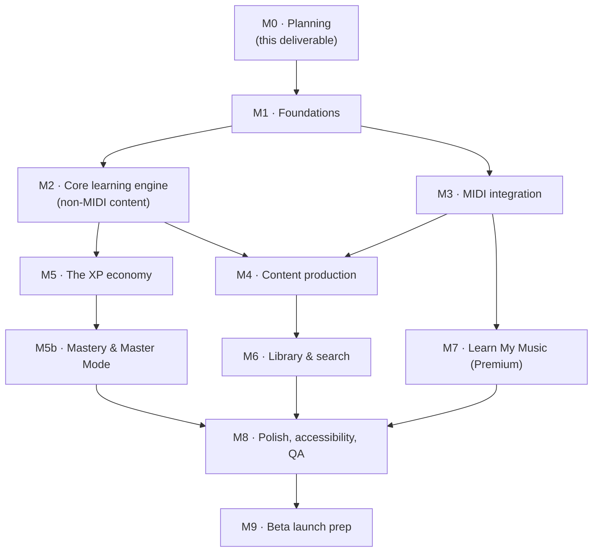

# 5. Development Roadmap

Milestones are sequenced by dependency, not calendar time (no team size/velocity given
yet); each carries a relative size (S/M/L/XL) as a rough planning input. Feature IDs
(`F-xx`) refer to the [PRD](./01-product-requirements.md).

## M0 — Planning *(current milestone)*
**Goal:** produce the requirements/architecture/schema/roadmap package for approval
before any code is written.
**Deliverables:** the five documents in this `docs/keyboard-app/` set.
**Exit criteria:** explicit sign-off from the product owner, including resolution of
the `DECISION NEEDED` items flagged in the PRD and architecture docs (genre-tag
choice, Expo-vs-Flutter confirmation, daily-challenge personalization — per-tier XP
costs are now settled, see PRD F-03). **No application code is written until this milestone is approved.**

## M1 — Foundations
**Size:** M
**Goal:** a running, empty shell across all three platforms, on the real architecture
— deliberately including desktop web as a full target from day one, not deferred.
**Deliverables:**
- Remove the unrelated Netlify portfolio starter content currently in this repo;
  scaffold the Turborepo monorepo layout from architecture §2.2.
- Expo app boots on iOS simulator, Android emulator, **and a desktop browser window**,
  sharing one navigation shell that already branches on the responsive breakpoint from
  architecture §2.1a (empty bottom tab bar under 1024px, empty left rail at or above
  it) — the responsive mechanism is proven on the very first screen, not retrofitted
  once mobile screens already exist.
- `services/api` skeleton (Fastify + tRPC) deployed to a dev environment; Supabase
  project provisioned (Postgres + Auth + Storage).
- Base schema migrations for `users`, `entitlements`, `midi_devices` (§4.2) and auth
  wired end-to-end (sign up/sign in from the app, same account usable from any
  platform immediately).
- CI: typecheck, lint, unit tests, and a build check for all three targets on every PR.
**Exit criteria:** a fresh install can create an account and see the empty three-tab
shell (Main Menu / Library / Profile) on all three platforms, in both the mobile and
desktop chrome layout; signing into the
same account from a second platform shows the same account state; CI green on main.

## M2 — Core learning engine (non-MIDI content first)
**Size:** L
**Goal:** the Main Menu, its per-category Tier Ladder, and the Lesson Player work
end-to-end for content types that don't require live MIDI input, so the
category/tier content model can be validated before the harder MIDI-integration
milestone lands.
**Deliverables:**
- `content-schema` package; `category_tiers` / `lessons` / `tags` tables (§4.3/§4.9b)
  and ingestion pipeline from the git-based `content/` directory. Every seeded lesson
  carries a `tier_id`; tier 1 in each category is unlocked by default for every user
  (no purchase flow needed yet — that's M5).
- **Main Menu screen — the app's home route** (screen map §3.3): exactly four tiles —
  Ear Training, Sight-Reading, Playback & Repeat, Learn My Music — wired to whatever's
  built so far and stubbed for the rest. Launch lands here directly; there is no
  dashboard route in front of it, and onboarding exits to it. Includes the
  header-level Show Note Names toggle (`users.show_note_names`, §4.2) and the
  spendable-XP readout (a static render until M5 makes the number spendable), plus the
  Continue / Daily Challenge momentum strip once those exist.
- **Category Tier Ladder screen** (screen map §3.3.1), shared shape across the three
  tiered categories: shows tier 1's lessons unlocked, later tiers visible but locked
  with their XP cost displayed (the *Unlock* button itself — the actual purchase
  transaction — lands in M5; this milestone only needs the read-only ladder view and
  tier-1 access to work).
- Lesson Player shell (screen map §3.4) supporting theory lesson types (no MIDI
  grading yet — multiple-choice/tap-based interaction).
- Ear Training drill engine (PRD F-02a, `ear_training_drills` §4.9): Drill Setup screen
  (interval vs. chord-progression mode, 2–8 note stepper, Difficulty 1–5 slider,
  major/minor/augmented/diminished quality multi-select), stimulus generation via the
  `core-theory` package, Drill Screen with multiple-choice grading and session summary.
- **`practice_intervals` recording starts here** (§4.10a), as soon as the first
  session type exists. It is a small piece of work with a hard ordering constraint:
  practice hours can only be counted from the moment the app starts writing them, so
  deferring this to the milestone that *displays* the number would ship a Profile
  reading "0 hours" for every existing user. The Profile UI comes later; the data
  collection cannot.
- A handful (3–5) of placeholder lessons per tier per category to validate the
  pipeline, not full V1 content volume (that's M4).
**Exit criteria:** a user can open any of the three tiered categories from the Main
Menu, see that category's Tier Ladder with tier 1 unlocked and later tiers visibly
locked with a cost, complete a tier-1 theory/ear-training lesson with progress
persisted (`user_progress`, §4.8), and reach every implemented category from the
Main Menu — which is also the screen the app opens on, from a cold start and from
onboarding alike.

## M3 — MIDI integration
**Size:** XL — highest technical risk in the roadmap; start early, expect iteration.
**Goal:** F-02 end-to-end: connect a MIDI keyboard and get real-time note/chord/
rhythm/timing feedback.
**Deliverables:**
- `midi` package with web (Web MIDI API) and native (CoreMIDI / Android MIDI API)
  transports behind the shared interface (architecture §2.3).
- MIDI Setup onboarding screen + Profile MIDI device management, incl. latency
  calibration.
- **On-screen keyboard component** — shared infrastructure, not a per-mode fallback.
  It renders on *every* play surface built from here on (Exercises, Sight-Reading,
  the Repeat drill, Ear Training, the Practice Screen), emits the same note events
  the `midi` package does, and reads `entitlements.plan` to render 2 octaves (free)
  or 61 keys (premium) — see PRD §1.4 and DB schema §4.2. Build it *before* the
  lesson types below, since they all mount it. Real MIDI input through the `midi`
  package is never range-limited, at any tier.
- `grading-engine` package (architecture §2.5), unit-tested against recorded MIDI
  event fixtures independent of any device.
- `notation` package (OSMD-in-WebView) with live cursor/highlight driven by grading
  results.
- Exercise lesson type (§4.4) fully working: play-along with real-time feedback and
  Session Summary.
- Sight-Reading (PRD F-02b, `sight_reading_passages` §4.4a): no-setup launch straight
  from an unlocked Sight-Reading tier into a passage with a randomly chosen
  Treble/Bass clef, Sight-Reading Screen rendering it via the `notation` package with
  live grading, Session Summary — it lands here rather than M2 because it needs live
  input, which means both the `grading-engine` and the on-screen keyboard above, not
  because it needs hardware. Tier-1 passages reachable and playable by the exit
  criteria below; the Tier Ladder purchase flow for tiers beyond 1 is still M5.
- The Repeat drill within Playback & Repeat (PRD F-02c,
  `repeat_drills`/`repeat_sessions`/`repeat_rounds` §4.9a): Difficulty Setup
  (Basic/Intermediate/Advanced), the growing-sequence Repeat Screen with per-round
  `grading-engine` checks and automatic tempo ramp-up, Session Summary — same
  live-input dependency, so it lands here alongside Sight-Reading and Exercises.
**Exit criteria:** two passes, one per input surface. (1) A real MIDI keyboard,
connected on each platform, drives correct hit/miss/early/late feedback on a simple
exercise, with latency that feels responsive (architecture §2.6 budget). (2) **With
no hardware connected at all**, the same exercise, a Sight-Reading passage, and a
Repeat round are each completable end to end by tapping the 2-octave on-screen
keyboard, graded by the same engine — this is the free-user path and it must work
before M4 authors content against it.

## M4 — Content production
**Size:** L (mostly content-authoring effort, not engineering)
**Goal:** hit V1 content volume from PRD F-01, organized into each category's real
tier ladder — this is where the illustrative XP-cost curve from PRD F-03 gets turned
into actual numbers per tier, tuned by whoever's authoring the content.
**Deliverables:**
- **Playback & Repeat's tier ladder fully populated**: 25–50 original exercises
  (`exercises`, §4.4), 25–50 chord-progression lessons (`chord_progressions` +
  `chord_progression_lessons`, §4.5, theory/listen/play-along stages), 10–20
  public-domain classical pieces engraved/sourced to MusicXML with verified PD
  licensing notes (`songs.license_source_note`), and 10–20 original practice songs
  composed in-house — all assigned to `category_tiers` rows (§4.9b) with real
  `xp_cost`s set, alongside the drill already built in M3.
- **Sight-Reading's tier ladder fully populated**: 15–20 curated passages
  (`sight_reading_passages`, §4.4a) spanning Treble, Bass, and Grand Staff clefs,
  distributed across that category's tiers with real XP costs.
- **Ear Training's tier ladder defined**: since its content is procedurally
  generated (not authored per-item), this is a smaller task — setting each tier's
  `difficulty_level` range and XP cost (`category_tiers`, §4.9b) rather than
  authoring individual lessons.
- **Four tiers per category, with the settled numbers** (PRD F-03, DB §4.9b) seeded
  as data, not hard-coded: costs 0 / 750 / 1,250 / 2,000 and earn rates 75 / 100 /
  125 / 150 XP per correct exercise, tier 4 `required_plan = premium`.
- **Content volume is now pace-constrained, not just quality-constrained.** At 750 XP
  for tier 2, a user clears it in ~10 correct tier-1 exercises, so each tier needs
  enough distinct exercises that they aren't repeating the same handful on the way
  through. Treat "exercises per tier" as a number to check against these costs during
  authoring, not an afterthought.
- **The 2-octave rule is a hard authoring constraint for tiers 1–3** in all three
  categories — every passage, exercise, song arrangement, and generated sequence in
  those tiers must be playable within 2 octaves, verified by the content linter, not
  by reviewer judgement. Tier 4 is the only place content may span the full 61 keys,
  which is what makes the premium tier and the premium keyboard one coherent offer.
- Genre tags (Pop/Rock, Jazz-basics, etc. — confirm which 2+ per PRD F-01's
  `DECISION NEEDED`) applied to Playback & Repeat / Library content.
**Exit criteria:** every category's tier ladder is playable start-to-finish with real
content and real XP costs, not placeholders; a content-linting CI check (schema
validation on the `content/` directory, including "every lesson has a valid
`tier_id`", "every category has exactly tiers 1–4 with only tier 4 premium", and
"every tier 1–3 item fits within 2 octaves") passes.

## M5 — The XP economy
**Size:** L — this is Keyvoria's primary progression system (PRD F-03), not a
secondary polish item; treat it with the weight of a core milestone, not a
nice-to-have.
**Goal:** F-03 end-to-end — XP earning *and spending* both work, making tiers beyond
each category's free tier 1 actually reachable for the first time.
**Deliverables:**
- `gamification` package: the earning rule (one correct exercise → that tier's flat
  rate, and **no other XP source** — PRD F-03), and the tier-unlock purchase transaction
  (validate balance and, where relevant, `entitlements`, then insert into
  `user_category_unlocks` — §4.9b) as one atomic, server-validated operation.
- `xp_events` / `user_category_unlocks` / `user_level` / `streaks` / `achievements` /
  `user_achievements` / `daily_challenges` / `daily_challenge_progress` tables
  (§4.9b/§4.10).
- The **Unlock** button on each category's Tier Ladder screen (§3.3.1) goes live:
  enabled/disabled based on live balance, a confirmation step before spending
  (spending is permanent per PRD F-03), and the "Tier unlocked!" reveal moment.
- The Main Menu header's spendable-XP display and Profile's Recommended-next-unlock
  card (screen map §3.3, §3.8)
  go live, reading real balance and real tier-cost data instead of placeholders.
- Progress Analytics' per-category XP balance/spend view (screen map §3.6) goes live
  alongside the per-skill accuracy mastery bars.
- **Profile tab as the user overview** (PRD F-07, screen map §3.8): total XP earned
  (lifetime, distinct from spendable), total hours practiced (`user_stats` §4.10a,
  reading the intervals recorded since M2), current streak, per-category tier
  summaries, and the recommended-next-unlock card. The subscription-management
  section of this screen is stubbed here and completed in M7, since it depends on
  billing existing.
**Exit criteria:** completing lessons/exercises/drills awards correct XP; a user can
spend accumulated XP to unlock a tier-2+ lesson in any of the three tiered
categories and immediately access it; attempting to unlock a `required_plan =
premium` tier without an entitlement is correctly blocked regardless of balance;
streak state updates daily with freeze behavior; a first batch of achievement rules
fire correctly; Progress Analytics reflects real balance, spend, and accuracy data.

## M5b — Mastery, Master Mode & achievements
**Size:** M
**Goal:** PRD F-08 — make finishing the curriculum an accomplishment worth displaying,
and give the finished user somewhere to keep playing.
**Deliverables:**
- `user_tier_clears` + `category_tiers.clear_target` (§4.10c). Clears are counted from
  correct exercises, **never** inferred from XP spend — that split is what stops
  "Keyvoria Master" from being purchasable, and it is the one thing in this milestone
  that must not be simplified away under time pressure.
- Mastery computation (tier cleared → category mastered → Keyvoria Master), derived at
  read time rather than stored as flags, so retuning `clear_target` can't strand a
  user holding a badge the new rule wouldn't grant.
- The seven V1 badges (F-08) and their evaluation after every graded exercise.
- **Achievement cards**: shared card component, native share sheet, and image export
  on native platforms. Card rendering reads `share_preferences` only — enforce this
  with a test that fails if the card query joins `users`.
- **Master Mode**: endless generator at expert difficulty per category plus Mixed,
  `master_runs` recording, streak scoring, tier-4 XP per correct challenge.
- **Leaderboards**: opt-in flow, `leaderboard_entries` materialisation, four metrics,
  and opt-out that **deletes** the row rather than hiding it.
- **Cosmetics**: four keyboard themes gated on badges, `user_cosmetics`.
**Exit criteria:** a user who buys every tier but plays nothing holds **zero** mastery;
a user who clears all twelve tiers earns Keyvoria Master and unlocks Master Mode and
the gold theme; a Master Mode run ends on the first wrong answer with the streak
recorded; an achievement card renders with no account-identifying data by default and
with a chosen display name when set; opting out of leaderboards removes the row.

## M6 — Library & search
**Size:** S
**Goal:** F-04.
**Deliverables:** Postgres full-text search (§4.12) over lessons/songs/tags; Library
tab search/filter UI and Item Detail screens (screen map §3.5), including the
category and tier/unlock-status filters and the "Unlock in [Category]" prompt on a
locked item's Item Detail.
**Exit criteria:** all M4 content is discoverable and filterable by category,
difficulty, skill tag, genre, duration, and completion status; a locked item correctly
routes the user toward unlocking it rather than a dead end.

## M7 — Learn My Music (Premium)
**Size:** XL — this is Keyvoria's primary premium feature (PRD F-05) and the
single most complex milestone content-wise; a prior draft split this into two
milestones (a free MIDI/MusicXML one and a paid MP3 one) — merged into one here
since the feature itself merged.
**Goal:** F-05 end-to-end for both upload formats, fully entitlement-gated, all
three practice modes.
**Deliverables:**
- `analysis` package: difficulty-scoring heuristic and section auto-segmentation for
  MIDI/MusicXML input (deterministic, client-side); `services/transcription`
  (basic-pitch + librosa) and job-queue wiring from `services/api` for MP3 input
  (best-effort, server-side).
- `user_uploads` / `generated_tutorials` / `tutorial_sections` /
  `estimated_chord_labels` tables (§4.11), and manual chord-label correction
  interaction for MP3 uploads.
- The `entitlements` check (§4.2) in front of the upload endpoint and the Main Menu
  tile for **every** upload type — a non-entitled user sees the Paywall screen
  (screen map §3.6 step 0) instead of Upload, regardless of what format they're
  about to pick.
- Upload → Processing → Mode Select flow (screen map §3.6) with all three modes
  working off one analysis pass — Sheet Music (via the `notation` package, gated by
  `generated_tutorials.sheet_music_available`), Synthesia-style (reusing the
  falling-notes surface and `grading-engine` from M3), and Auto-Play (synthesized
  piano playback with pause/scrub) — plus 0.25×–2× continuous speed control and
  hands-separate practice across all three modes.
- The persistent **Estimated** banner on MP3-sourced tutorials only (`is_estimated`,
  §4.11) — MIDI/MusicXML-sourced tutorials show no such banner, since PRD F-05 is
  explicit that format determines confidence, not entitlement.
- The full **subscription lifecycle**, not just the purchase (architecture §2.6a,
  DB §4.10b): buy at $9.95/month on all three storefronts, provider webhooks driving
  `subscriptions` and `entitlements`, and **cancellation** — Stripe cancelled in-app,
  Apple/Google deep-linked to their own management surfaces, with
  `cancel_at_period_end` preserving access to the end of the paid period and a
  scheduled sweep catching missed webhooks. Cancelling must be reachable in one tap
  from the Profile tab (PRD F-07). This milestone can ship its *upload* features
  against a manually-granted `entitlements` row for beta testers if the billing
  integration lags, but it cannot ship to real users without the cancel path — an
  app that can only be subscribed to is not shippable to either store.
**Exit criteria:** a subscription can be purchased, seen from a *different* platform
than it was bought on, cancelled, and confirmed to retain access until period end and
to relock tier 4 / the 61-key keyboard / Learn My Music only after it — with XP,
tier 1-3 unlocks, progress and uploaded files all intact afterwards; a non-entitled
user is correctly blocked at the Paywall for both upload formats; an entitled user can upload a real-world MIDI/MusicXML file and get a
working, gradable, non-estimated tutorial; an entitled user can upload an MP3 and get
tempo-detected, loopable, speed-adjustable playback in all three modes with
best-effort output unambiguously marked as an estimate throughout the UI.

## M8 — Polish, accessibility, QA
**Size:** M
**Goal:** cross-platform parity and quality bar from PRD §1.5.
**Deliverables:** accessibility pass (color-blind-safe feedback, scalable text,
screen-reader chrome), offline-mode QA (content caching + delta sync per architecture
§2.7), performance/latency profiling of the MIDI grading loop on real devices, visual
design pass across all screens for the "modern, motivating, musical" bar from the
original brief, desktop-breakpoint QA (architecture §2.1a — left-rail chrome, wider
Tier Ladder/Practice Screen layouts, hover states and keyboard shortcuts all actually
exercised, not just the mobile layout at a wider window), and explicit **cross-device
sync QA**: earn/spend XP, complete a lesson, or upload a file on one platform,
confirm it's correctly reflected on a second platform within a normal refresh —
covering all four items in architecture §2.7's sync list (XP balance & streaks,
unlocked category tiers, entitlements, uploaded music), not just progress. Also a
full pass on the **XP economy's balance** specifically (PRD F-03): with real M4
content and costs in place, does saving up for a tier actually feel meaningful, or
does XP come too easily/slowly — this is exactly the "make sure XP isn't cosmetic"
goal from the PRD, checked against real numbers for the first time.
**Exit criteria:** no P0/P1 bugs open; latency budget met on representative iOS/Android
hardware and major web browsers; accessibility checklist signed off; cross-device sync
verified for all four synced data categories; XP-economy balance reviewed against
real content and adjusted if a category's costs feel trivial or punishing.

## M9 — Beta launch prep
**Size:** S–M
**Goal:** ready for a real user beta.
**Deliverables:** App Store / Play Store submission assets and review, telemetry and
crash reporting wired up, support/feedback channel, final licensing audit of all
classical-piece sourcing (PRD §1.5 licensing integrity requirement) before public
release.
**Exit criteria:** builds live in TestFlight/Play Internal Testing and the web app
deployed to a production URL, with a defined beta feedback loop in place.
