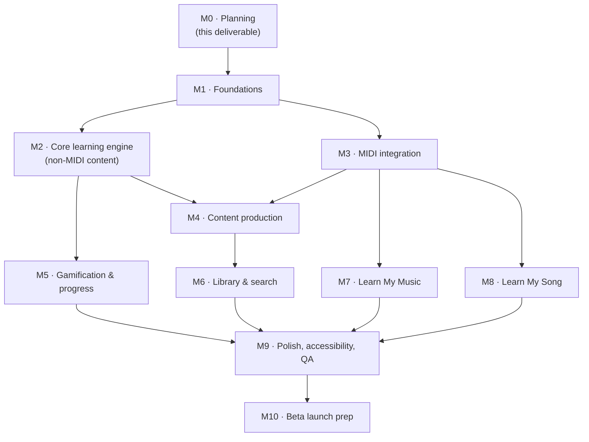

# 5. Development Roadmap

Milestones are sequenced by dependency, not calendar time (no team size/velocity given
yet); each carries a relative size (S/M/L/XL) as a rough planning input. Feature IDs
(`F-xx`) refer to the [PRD](./01-product-requirements.md).

## M0 — Planning *(current milestone)*
**Goal:** produce the requirements/architecture/schema/roadmap package for approval
before any code is written.
**Deliverables:** the five documents in this `docs/keyboard-app/` set.
**Exit criteria:** explicit sign-off from the product owner, including resolution of
the `DECISION NEEDED` items flagged in the PRD and architecture docs (genre-path
choice, Expo-vs-Flutter confirmation, monetization stub, daily-challenge
personalization). **No application code is written until this milestone is approved.**

## M1 — Foundations
**Size:** M
**Goal:** a running, empty shell across all three platforms, on the real architecture
— deliberately including desktop web as a full target from day one, not deferred.
**Deliverables:**
- Remove the unrelated Netlify portfolio starter content currently in this repo;
  scaffold the Turborepo monorepo layout from architecture §2.2.
- Expo app boots on iOS simulator, Android emulator, **and a desktop browser window**,
  sharing one navigation shell that already branches on the responsive breakpoint from
  architecture §2.1a (empty bottom tab bar under 1024px, empty left rail at or above
  it) — the responsive mechanism is proven on the very first screen, not retrofitted
  once mobile screens already exist.
- `services/api` skeleton (Fastify + tRPC) deployed to a dev environment; Supabase
  project provisioned (Postgres + Auth + Storage).
- Base schema migrations for `users`, `entitlements`, `midi_devices` (§4.2) and auth
  wired end-to-end (sign up/sign in from the app, same account usable from any
  platform immediately).
- CI: typecheck, lint, unit tests, and a build check for all three targets on every PR.
**Exit criteria:** a fresh install can create an account and see an empty dashboard on
all three platforms, in both the mobile and desktop chrome layout; signing into the
same account from a second platform shows the same account state; CI green on main.

## M2 — Core learning engine (non-MIDI content first)
**Size:** L
**Goal:** the Learn tab and Lesson Player work end-to-end for content types that don't
require live MIDI input, so path/content mechanics can be validated before the harder
MIDI-integration milestone lands.
**Deliverables:**
- `content-schema` package; `learning_paths` / `path_units` / `lessons` / `tags`
  tables (§4.3) and ingestion pipeline from the git-based `content/` directory.
- Visual learning path (skill tree) screen with lock/unlock logic.
- Lesson Player shell supporting theory and ear-training lesson types (no MIDI grading
  yet — multiple-choice/tap-based interaction).
- **Main Menu screen** (screen map §3.5, the Practice tab's home): exactly four tiles
  — Ear Training, Sight Reading, Repeat, Learn My Song — wired to whatever's built so
  far and stubbed for the rest, so the hub exists from early on rather than being
  bolted on later. Includes the header-level Show Note Names toggle (`users.
  show_note_names`, §4.2) even before every screen that could honor it exists yet.
- Ear Training drill engine (PRD F-02a, `ear_training_drills` §4.9): Drill Setup screen
  (interval vs. chord-progression mode, 2–8 note stepper, Difficulty 1–5 slider,
  major/minor/augmented/diminished quality multi-select), stimulus generation via the
  `core-theory` package, Drill Screen with multiple-choice grading and session summary.
- A handful (3–5) of placeholder lessons per type to validate the pipeline, not full
  V1 content volume (that's M4).
**Exit criteria:** a user can pick a path, move through the skill tree, complete a
theory/ear-training lesson with progress persisted (`user_progress`, §4.8), and reach
every implemented training type from the Main Menu.

## M3 — MIDI integration
**Size:** XL — highest technical risk in the roadmap; start early, expect iteration.
**Goal:** F-02 end-to-end: connect a MIDI keyboard and get real-time note/chord/
rhythm/timing feedback.
**Deliverables:**
- `midi` package with web (Web MIDI API) and native (CoreMIDI / Android MIDI API)
  transports behind the shared interface (architecture §2.3).
- MIDI Setup onboarding screen + Profile MIDI device management, incl. latency
  calibration.
- On-screen keyboard component (the no-MIDI input surface from F-02's reduced mode):
  reads `entitlements.plan` to render 2 octaves (free) or 61 keys (premium) — see PRD
  §1.4's Free vs. Premium table and DB schema §4.2. Real MIDI input through the `midi`
  package is never range-limited, at any tier.
- `grading-engine` package (architecture §2.5), unit-tested against recorded MIDI
  event fixtures independent of any device.
- `notation` package (OSMD-in-WebView) with live cursor/highlight driven by grading
  results.
- Exercise lesson type (§4.4) fully working: play-along with real-time feedback and
  Session Summary.
- Sight Reading (PRD F-02b, `sight_reading_passages` §4.4a): no-setup launch straight
  from the Main Menu tile into a passage with a randomly chosen Treble/Bass clef and
  auto-matched difficulty, Sight Reading Screen rendering it via the `notation`
  package with live grading, Session Summary — this mode needs a MIDI keyboard so it
  lands here rather than M2.
- Repeat (PRD F-02c, `repeat_drills`/`repeat_sessions`/`repeat_rounds` §4.9a):
  Difficulty Setup (Basic/Intermediate/Advanced), the growing-sequence Repeat Screen
  with per-round `grading-engine` checks and automatic tempo ramp-up, Session Summary
  — also MIDI-only, so it lands here alongside Sight Reading and Exercises.
**Exit criteria:** a real MIDI keyboard, connected on each platform, drives correct
hit/miss/early/late feedback on a simple exercise, with latency that feels responsive
(architecture §2.6 budget).

## M4 — Content production
**Size:** L (mostly content-authoring effort, not engineering)
**Goal:** hit V1 content volume from PRD F-01.
**Deliverables:**
- 25–50 original exercises authored (`exercises`, §4.4).
- 25–50 chord-progression lessons authored (`chord_progressions` +
  `chord_progression_lessons`, §4.5), covering the theory/listen/play-along stages.
- 10–20 public-domain classical pieces engraved/sourced to MusicXML with verified PD
  licensing notes (`songs.license_source_note`).
- 10–20 original practice songs composed in-house.
- 15–20 sight-reading passages (`sight_reading_passages`, §4.4a) spanning Treble,
  Bass, and Grand Staff clefs across the difficulty range.
- Beginner/Intermediate/Advanced paths and the confirmed genre path(s) fully sequenced
  end to end (not just placeholders).
**Exit criteria:** every path in the PRD's F-01 scope is playable start-to-finish with
real content; a content-linting CI check (schema validation on the `content/`
directory) passes.

## M5 — Gamification & progress
**Size:** M
**Goal:** F-03 end-to-end.
**Deliverables:** `gamification` package; `xp_events` / `user_level` / `streaks` /
`achievements` / `user_achievements` / `daily_challenges` / `daily_challenge_progress`
tables (§4.10) and the corresponding Home/Achievements/Streaks/Progress-Analytics
screens (screen map §3.3, §3.9).
**Exit criteria:** completing lessons/exercises awards correct XP, streak state updates
daily with freeze behavior, a first batch of achievement rules fire correctly, and the
Progress Analytics per-skill breakdown reflects real attempt data (§4.8's
`attempts.accuracy_*` fields).

## M6 — Library & search
**Size:** S
**Goal:** F-04.
**Deliverables:** Postgres full-text search (§4.12) over lessons/songs/tags; Library
tab search/filter UI and Item Detail screens (screen map §3.6).
**Exit criteria:** all M4 content is discoverable and filterable by difficulty, skill
tag, genre, duration, and completion status.

## M7 — Learn My Music
**Size:** L
**Goal:** F-05 end-to-end.
**Deliverables:** `analysis` package difficulty-scoring heuristic and section
auto-segmentation for MIDI/MusicXML input; `user_uploads` / `generated_tutorials` /
`tutorial_sections` tables (§4.11); Upload → Processing → Tutorial Overview →
Tutorial Player flow (screen map §3.7) including hands-separate mode, loop selector,
0.25×–2× continuous speed control, and performance grading reusing `grading-engine`
from M3.
**Exit criteria:** a user can upload a real-world MIDI or MusicXML file and get a
working, gradable tutorial with an honest difficulty rating.

## M8 — Learn My Song (audio upload & analysis, Premium)
**Size:** L
**Goal:** F-06 end-to-end, all three learn modes, entitlement-gated.
**Deliverables:** `services/transcription` (basic-pitch + librosa); job-queue wiring
from `services/api`; `estimated_chord_labels` table and manual-correction interaction
(§4.11); the `entitlements` check (§4.2) in front of the upload endpoint and the Main
Menu tile — a non-entitled user sees the Paywall screen (screen map §3.8a step 0)
instead of Upload; Upload → Processing → Mode Select flow with all three modes working
off the one transcription — Sheet Music (via the `notation` package, gated by
`generated_tutorials.sheet_music_available`), Synthesia-style (reusing the
falling-notes surface and `grading-engine` from M3/M7), and Auto-Play (synthesized
piano playback with pause/scrub); 0.25×–2× continuous speed control across all three
modes — plus the persistent "Estimated" labeling
requirement from the PRD enforced in the UI (not just a one-time toast). The actual
billing/purchase flow behind the entitlement is out of this milestone's scope until
PRD §1.6's pricing-mechanic decision lands — M8 can ship gated on a manually-granted
`entitlements` row for beta testers if the billing integration isn't ready yet.
**Exit criteria:** a user can upload an MP3 and get tempo-detected, loopable,
speed-adjustable playback in all three modes, with best-effort chord/note output that
is unambiguously marked as an estimate throughout the UI, and a non-entitled user is
correctly blocked at the Paywall.

## M9 — Polish, accessibility, QA
**Size:** M
**Goal:** cross-platform parity and quality bar from PRD §1.5.
**Deliverables:** accessibility pass (color-blind-safe feedback, scalable text,
screen-reader chrome), offline-mode QA (content caching + delta sync per architecture
§2.7), performance/latency profiling of the MIDI grading loop on real devices, visual
design pass across all screens for the "modern, motivating, musical" bar from the
original brief, desktop-breakpoint QA (architecture §2.1a — left-rail chrome, wider
Learning Path/Practice Screen layouts, hover states and keyboard shortcuts all
actually exercised, not just the mobile layout at a wider window), and explicit
**cross-device sync QA**: earn XP/complete a lesson/upload a file on one platform,
confirm it's correctly reflected on a second platform within a normal refresh —
covering all four items in architecture §2.7's sync list (XP & streaks, unlocked
lessons/path progress, entitlements, uploaded music), not just progress.
**Exit criteria:** no P0/P1 bugs open; latency budget met on representative iOS/Android
hardware and major web browsers; accessibility checklist signed off; cross-device sync
verified for all four synced data categories.

## M10 — Beta launch prep
**Size:** S–M
**Goal:** ready for a real user beta.
**Deliverables:** App Store / Play Store submission assets and review, telemetry and
crash reporting wired up, support/feedback channel, final licensing audit of all
classical-piece sourcing (PRD §1.5 licensing integrity requirement) before public
release.
**Exit criteria:** builds live in TestFlight/Play Internal Testing and the web app
deployed to a production URL, with a defined beta feedback loop in place.
